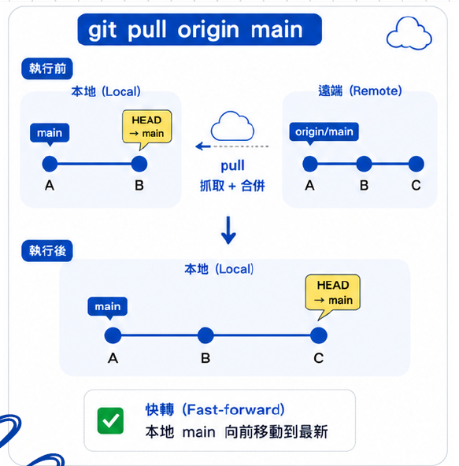
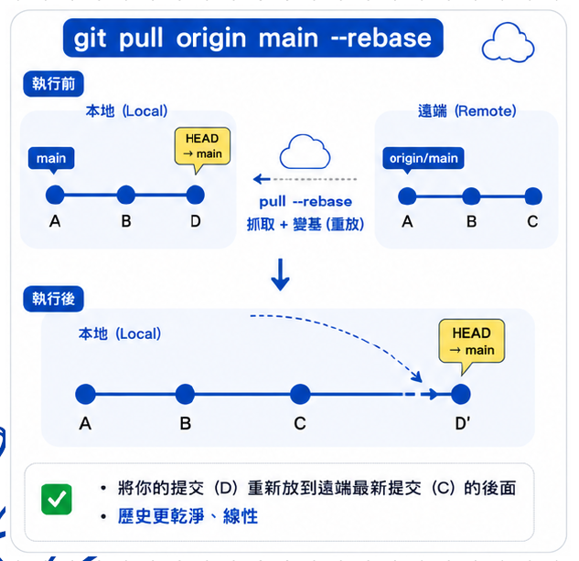
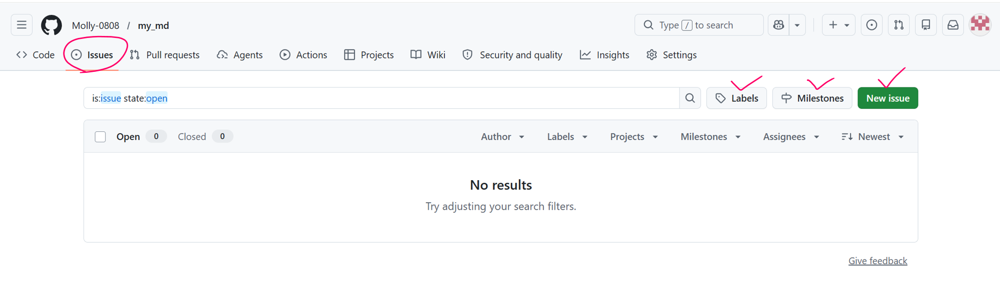
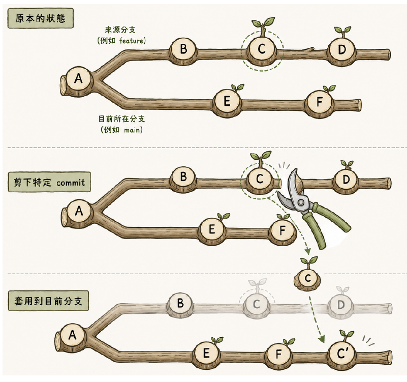
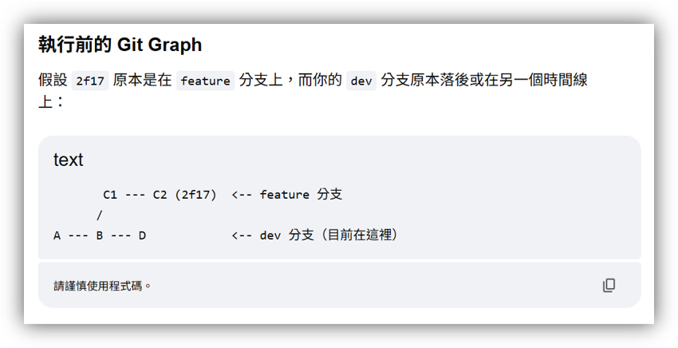
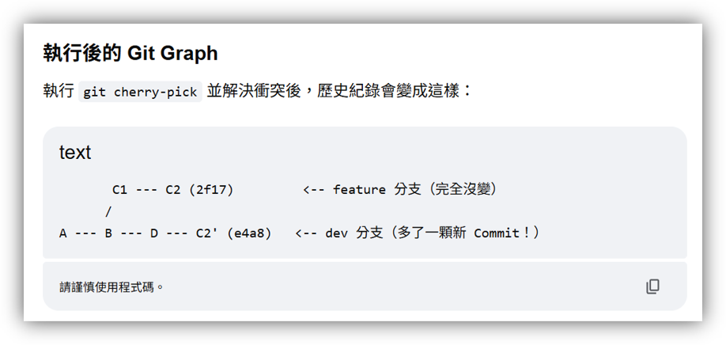

# Git-and-GitHub-Notes

- [Git-and-GitHub-Notes](#git-and-github-notes)
  - [練習題網址和檔案](#練習題網址和檔案)
  - [git config](#git-config)
    - [基本設定](#基本設定)
    - [用 git config 設定指令的縮寫](#用-git-config-設定指令的縮寫)
    - [用 git config 設定今後的 master 都自動變成 main](#用-git-config-設定今後的-master-都自動變成-main)
  - [git init](#git-init)
    - [如何建立 .git 資料夾](#如何建立-git-資料夾)
    - [如何取消 git init](#如何取消-git-init)
  - [git add 【從工作目錄加到暫存區】](#git-add-從工作目錄加到暫存區)
    - [如何 git add](#如何-git-add)
    - [如何取消 git add](#如何取消-git-add)
  - [git commit 【從暫存區加到本地儲存庫】](#git-commit-從暫存區加到本地儲存庫)
    - [如何 commit](#如何-commit)
    - [如何取消 commit](#如何取消-commit)
  - [查看紀錄相關指令](#查看紀錄相關指令)
    - [git status](#git-status)
    - [git blame](#git-blame)
    - [git log](#git-log)
    - [git branch](#git-branch)
    - [git reflog](#git-reflog)
    - [git remote](#git-remote)
    - [git stash](#git-stash)
  - [git branch](#git-branch-1)
    - [git switch](#git-switch)
    - [git checkout](#git-checkout)
    - [detached HEAD 斷頭狀態](#detached-head-斷頭狀態)
  - [git push](#git-push)
    - [推送的前置作業](#推送的前置作業)
    - [正式推送](#正式推送)
  - [.gitignore](#gitignore)
    - [那 API KEY 放哪?](#那-api-key-放哪)
  - [git reset](#git-reset)
  - [git merge](#git-merge)
    - [如何 git merge](#如何-git-merge)
    - [如何取消 git merge](#如何取消-git-merge)
    - [vim 編輯器](#vim-編輯器)
    - [merge 解決衝突](#merge-解決衝突)
  - [git rebase](#git-rebase)
    - [如何 git rebase](#如何-git-rebase)
    - [如何取消 git rebase](#如何取消-git-rebase)
    - [rebase 解決衝突](#rebase-解決衝突)
  - [git clone](#git-clone)
  - [git fetch](#git-fetch)
  - [git pull](#git-pull)
    - [git pull 儲存庫名 分支名](#git-pull-儲存庫名-分支名)
    - [git pull 儲存庫名 分支名 --rebase](#git-pull-儲存庫名-分支名---rebase)
  - [GitHub 多人協作](#github-多人協作)
    - [開 issues](#開-issues)
    - [PR (Pull requests)](#pr-pull-requests)
      - [發PR前要做：](#發pr前要做)
      - [發 PR 流程：](#發-pr-流程)
    - [解衝突](#解衝突)
  - [git stash](#git-stash-1)
  - [git cherry-pick](#git-cherry-pick)
    - [如何 git cherry-pick](#如何-git-cherry-pick)
    - [如何取消 git cherry-pick](#如何取消-git-cherry-pick)
    - [實例](#實例)

## 練習題網址和檔案

題庫：https://hackmd.io/IbWp68diQGiy8x-9yBmPlw?view#Git-reset-amp-reflog-%E7%B7%B4%E7%BF%92

檔案：https://drive.google.com/drive/u/0/folders/1P5agqEJUM2Lac6sC2k4e6Q7dafb8uJUG

## git config

### 基本設定

1. 開啟 VS Code 內建終端機：按 Ctrl ` (Tab 上面那)
2. 檢查git設定值：$`git config --lis`
3. 設定user.name：$`git config --global user.name "我的名字"`
4. 設定user.email：$`git config --global user.email "我的信箱"`

>     有傳遞 --global參數，只需操作一次

### 用 git config 設定指令的縮寫

- $`git config --global alias.別名nnn "原指令log --oneline --author"`
  - 縮寫變：$`git nnn`

### 用 git config 設定今後的 master 都自動變成 main

- $`git config --global init.defaultBranch main`

[返回目錄](#git-and-github-notes)

## git init

### 如何建立 .git 資料夾

1. 建立資料夾並cd過去：$`mkdir 資料夾名字; cd 資料夾名字`
2. 開啟 VS Code：$`code .`
3. 開啟 VS Code 內建終端機：按 Ctrl ` (Tab 上面那)
4. 生成 .git 資料夾：$`git in`
5. 確認版本號：$`git --version `

### 如何取消 git init

- 使用 VS Code 內建終端機
  - 輸入$`Remove-Item -Recurse -Force .git`

- 手動刪除
  - 開啟 VS Code 檔案總管，直接刪除 .git 資料夾

[返回目錄](#git-and-github-notes)

## git add 【從工作目錄加到暫存區】

### 如何 git add

- 加入某個檔案：$`git add aaa.md`

- 加入某個資料夾(內的所有檔案)：$`git add 資料夾名稱/`

- 加入某個資料夾內的某個檔案：$`git add 資料夾名稱/aaa.md`

- 加入目前所有資料夾內全部有新增或修改過的檔案：$`git add .`(點點前要有空格)

- 一次性加入特定多個檔案：$`git add aaa.md bbb.md ccc.md`(檔案中間空格即可)

>     git add 不會加入資料夾，只會加入「檔案」，所以如果命令輸入資料夾，代表加入該資料夾內的所有檔案

### 如何取消 git add

- 從暫存區移除某個檔案：$`git restore --staged aaa.md`
  - 舊式/傳統指令，效果同上：$`git reset aaa.md`

- 清空暫存區：$`git restore --staged .`

[返回目錄](#git-and-github-notes)

## git commit 【從暫存區加到本地儲存庫】

### 如何 commit

- 儲存檔案：$`git commit -m "第一次commit"`
  - git add 後 commit 的東西就是剛才 add 過的檔案

- 修改最新commit的備註訊息(SHA值會變)：$`git commit --amend -m "有錯字可改"`

- 把所有「已修改」和「已刪除」的檔案 add 並 commit：$`git commit -a -m "跳過暫存區直接儲存囉"`

### 如何取消 commit

如果已經commit過，需要修改檔案，只要重新add再commit就好

[返回目錄](#git-and-github-notes)

## 查看紀錄相關指令

### git status

- 用於察看以下檔案情況：
  - 查看「未追蹤的檔案」：新建立的檔案還沒add，顯示紅色

  - 查看「已修改但尚未暫存」：已經追蹤過，但因為有修改過，還沒重新add，顯示紅色

  - 查看「準備提交的變更」：已經add，在暫存區排隊，顯示綠色

### git blame

- 查看每一行最後修改者、提交時間：$`git blame`

### git log

- 查看commit歷史紀錄：$`git log`

- 單行顯示commit歷史紀錄：$`git log --oneline`

- 限制顯示幾個commit歷史紀錄：$`git log -n 3`

- 查看包含branch的走向：$`git log --graph`

- 查看完整修改內容：$`git log -p`

- 查看特定人的commit：$`git log --oneline --author="想查的名字"`
  - =和後面的”人名”之間不能有空格，且人名呈現灰色是正常的

- 查看特定字的commit：$`git log --oneline --grep="想查的字"`

- 查看特時間區間的commit：$`git log --since="2026-04-14 09:00" --until="2026-04-14 17:30"`

### git branch

- 查看目前 (本機) 有哪些 branches：$`git branch`

- 查看所有 branch 包含遠端(all)：$`git branch -a`

### git reflog

git reflog 記錄「滑鼠與鍵盤操作 Git 的歷史」，通常會保留 30 到 90 天。

- 每一次 HEAD 移動：$`git reflog`

- 看某個分支的移動紀錄：$`git reflog 分支名`

- 顯示最近 5 筆：$`git reflog -n 5`

- 在什麼時間點，讓 HEAD 做了什麼變動：$`git reflog --date=local`

### git remote

- 列出所有遠端倉庫的簡稱：$`git remote`

- 顯示遠端倉庫的簡稱及其對應的詳細 URL：$`git remote -v`

### git stash

- 查看所有暫存清單：$`git stash list`

[返回目錄](#git-and-github-notes)

## git branch

- 在現在位置建立名為 momo 的分支：$`git branch momo`

- 刪除名為 momo 的分支：$`git branch -d momo`

- 強制刪除名為 momo 的分支：$`git branch -D momo`

- 重新命名分支：$`git branch -m 新分支名`

- 強制重新命名分支：$`git branch -M 新分支名`

- 在指定的 commit（SHA）位置建立一個新的分支：$`git branch 分支名 SHA值`

- 以 dev 分支為基礎，建立一個 momo 本地分支：$`git branch momo dev`

### git switch

- 將 HEAD(我的編輯位置) 移到指定的分支：$`git switch 指定分支名`

- 建立新分支並把位置切換去新分支：$`git switch -c 分支名`

- 切換位置回上一個分支：$`git switch -`

- 切換位置到指定 commit（進入斷頭 detached HEAD）：$`git switch --detach SHA值`

### git checkout

- 將 HEAD(我的編輯位置) 移到指定的分支：$`git checkout 指定分支名`

- 建立新分支並把位置切換去新分支：$`git checkout -b 分支名`

- 切換位置回上一個分支：$`git checkout -`

- 切換位置到指定 commit（進入斷頭 detached HEAD）：$`git checkout SHA值`

- 僅單一檔案內容恢復成指定 commit 的版本：$`git checkout SHA值 aaa.md`

[返回目錄](#git-and-github-notes)

### detached HEAD 斷頭狀態

>     情況：我不小心checkout到某個SHA值上並且變動檔案，已經add和commit，等於我在不屬於我的branch上commit了(就是我根本沒有在任何branch上commit)。

如果我想保留剛剛的修改，並安全回到 main，解決辦法：

強制將 main 分支的標籤移動到新做好的 SHA 值上：$`git branch -f main 新SHA值`

這時 main 已經移過來了，但我還在斷頭狀態，需切回 main 分支 ：$`git checkout main`

[返回目錄](#git-and-github-notes)

## git push

### 推送的前置作業

如何開新的 GitHub 儲存庫：


- 在本地加入遠端 GitHub 儲存庫並取名字：$`git remote add 儲存庫名 儲存庫網址`
  - 網址在GitHub那邊

  - 儲存庫名預設是 origin ，可自己改別的名字。

1. 單次把 master 變成 main：$`git branch -M main`

2. 首次推送本地分支 main 到遠端儲存庫 origin，並設定上游分支的對應：$`git push -u 儲存庫名origin 本地分支main`

>     設定上游分支的對應是指 -u，即 --set-upstream 的縮寫。

- 儲存庫重新命名：$`git remote rename 舊名 新名`

### 正式推送

- 推送預設分支到預設的遠端儲存庫：$`git push`

- 推送分支到遠端儲存庫：$`git push 儲存庫名origin 分支名main`

- 強制推送：$`git push 儲存庫名origin 分支名main -f`

- 本地的某分支推到遠端的某分支 (名字相同時可省略)：$`git push 儲存庫名origin 本地分支名:遠端分支名`
  - 例如：git push origin feature:feature 可簡寫為 git push origin feature

- 刪除遠端分支：$`git push 儲存庫名origin :遠端分支名`
  - 冒號前面要留空格，因為冒號前面原本是本地分支的位置，但現在空著，等於是用「空無一物」覆蓋遠端分支，結果就是把該遠端分支刪除了。

[返回目錄](#git-and-github-notes)

## .gitignore

指定哪些檔案不要被 Git 版控，例如：金鑰（API KEY、密碼）、設定檔（.env）、編譯產物（node_modules、dist）、系統檔（.DS_Store）


- 把已經 commit 過但後來發現不需要追蹤的檔案從 Git 庫中剔除，並且不刪除檔案：$`git rm --cached 檔名`

### 那 API KEY 放哪?

- .env（環境變數檔）：只存在於本機電腦，在檔案裡寫真的 API KEY、資料庫密碼。

- .env.example（範本檔）：只寫欄位名稱（例如 API_KEY= 留空），不寫真實密碼，給新加入專案的人看到底有多少密碼種類，再去跟建立專案的人要密碼。

[返回目錄](#git-and-github-notes)

## git reset

讓分支 Git 回到過去某一刻，順便決定要不要保留修改。

至少要有兩次commit才可以做到「回到上一個commit」。

- 回到過去的某個 commit（預設--mixed）：$`git reset SHA值`
  - 所有異動的檔案變回 unstaged（add 前）：$`git reset --mixed SHA值`
  - 所有異動的檔案變回 staged（add 後）：$`git reset --soft SHA值`
  - 所有異動的檔案全部還原（謹慎使用）：$`git reset --hard SHA值`

>     mixed和soft不會刪掉檔案和修改，但是hard會刪掉。

- 從暫存區移除某個檔案(舊式/傳統指令)：$`git reset aaa.md`
  - 新式，效果同上：$`git restore --staged aaa.md`

- 回到上一個 commit （^ 代表往上一層）：$`git reset HEAD^`

- 回到前 3 個 commit（~n 代表往前 n 步）：$`git reset HEAD~3`

- 回到某 commit 的上一步：$`git reset SHA值^`

- 回到某 commit 的前幾步：$`git reset SHA值~3`

返回[git-reflog](#git-reflog)

[返回目錄](#git-and-github-notes)

## git merge

將另一個分支的變更合併進「我目前所在的分支」。

1. 快進式合併 (Fast-Forward)：不增加新的 Commit，直接把進度指標往前推進到目標分支的最新位置，不會生成新的節點。
   - 情況：momo分支有新的 commit ，main分支沒有。

2. 三方合併 (3-way Merge)：兩邊都有新進度，Git 找出共同祖先並融合雙方修改，自動生成一個新的合併節點。
   - 情況：momo分支和main分支都有新的 commit 。

### 如何 git merge

- 將momo分支合併到目前所在的分支：$`git merge momo`

>     git merge momo 的效果是 HEAD 會在目前所在分支上，並且會排在最上面。

- 優先使用快進：$`git merge -ff 分支名`
  - -ff 代表 Fast-Forward（快進）

- 強迫 Git 建立一個新的節點：$`git merge --no-ff 分支名`

- 強迫 Git 建立一個新的節點，並指定訊息（不會進到 vim 編輯器）：$`git merge --no-ff -m "commit訊息" 分支名`

### 如何取消 git merge

- 取消 merge（發生衝突時）：$`git merge --abort`

### vim 編輯器

vim 是跑在終端機裡的文字編輯器。

當遇到會產生新節點的Y字型情況，執行完 $`git merge 分支名` 之後，會跳出問我要不要改備註訊息的vim編輯器，如果我想改就先打小寫 i 進入編輯模式，改好之後按esc退出編輯，再打 :wq 就能做到儲存並離開。


### merge 解決衝突

```
>>>分別在 krystal 和 dev 做 commit：

git checkout krystal
在aaa.html新增一個p
git add .
git commit -m "kp"
git checkout dev
在aaa.html新增一個div
git add .
git commit –m “devdiv”

>>>在 dev 把 krystal 合併進來 dev(dev會在最上面)：
git merge krystal

>>>解衝突：
因為兩個分支都在同個檔案做更動
所以產生了衝突
可以擇一保留或兩者都要或都不要
選完記得 ctrl+s 存檔
(存檔前也可以自己打字更動內容)
然後記得 add、commit
git add .
git commit -m "解決衝突"
```

[返回目錄](#git-and-github-notes)

## git rebase

複製目前的進度，剪貼到目標分支的最新 Commit 後面，讓歷史紀錄變成一條乾淨的直線。

舉例：

```
         ┌── C1 ── C2 (你的 dev 分支)
         │
(main) ─── A ─── B (目標 main 分支)
```

在 dev 分支執行 git rebase main 之後......

```
(main) ─── A ─── B ─── C1' ─── C2'
```

### 如何 git rebase

- 將目前分支嫁接到momo分支之後：$`git rebase momo`

- 解決衝突後，繼續解下一個 commit 的衝突：$`git rebase --continue`

>     絕對不要對「已經推送到遠端（GitHub）」的 Commit 執行 Rebase，因為 Rebase 是「複製並刪除舊節點」，會改變 Commit 的 SHA 值。

### 如何取消 git rebase

- 取消 rebase：$`git rebase --abort`

- 跳過解當前 commit 的衝突：$`git rebase --skip`

### rebase 解決衝突

```
先建立 andy 分支
分別在 dev 和 andy 做 commit
因為兩個分支都在同個檔案做更動
所以產生了衝突
在 andy 把 andy 嫁接到 dev 之後(andy會在最上面)

rebase 解決衝突的方式和merge不太一樣
因為 rebase 的嫁接方式是把 andy 的 commit 一顆顆丟過去 dev 比對衝突
解決衝突的過程一樣是擇一保留或兩者都要或都不要
選完記得ctrl+s存檔
存檔前也可以自己打字更動內容
一樣要記得add

>>>這邊開始不一樣：
不用輸入 git commit -m “解決衝突“ 的指令
而是輸入 git rebase --continue
然後就可以繼續檢查下一個 commit 的衝突
```

[返回目錄](#git-and-github-notes)

## git clone

把遠端 repository 複製一份到本地（把 GitHub 專案整包抓到本地來用）。

git clone 會做的事情：

- 下載整個專案
- 自動建立 .git
- 自動設定遠端 origin

指令：$`git clone <repo-url>`

1. 開電腦終端機
2. 先 cd 到我要放這個專案資料夾的位置
3. 再輸入 `git clone <repo-url>` (網址在GitHub)
4. 開 VS Code 把資料夾抓進去就成功啦


[返回目錄](#git-and-github-notes)

## git fetch

>     1. 工作目錄不會改變
>     2. HEAD 不會動
>     3. 不會有衝突，因為只「下載」，還未「合併（Merge）」

從遠端儲存庫下載某分支到本地電腦：$`git fetch 儲存庫名 分支名`

舉例：git fetch origin dev：將 origin 遠端儲存庫的 dev 分支上所有本地電腦還沒有的 Commit、檔案和歷史紀錄，全下載到電腦的 .git 資料夾，同時 origin/dev 會移到最上面。

> 記得把 Show Remote Brench 打勾才看得到遠端分支。

[返回目錄](#git-and-github-notes)

## git pull

### git pull 儲存庫名 分支名

>     1. 等同於 git fetch + git merge
>     2. HEAD 會移動
>     3. 有分叉時會產生 merge commit

從遠端儲存庫下載某分支到本地電腦，並將它 merge 到當前所在的本地分支中：$`git pull 儲存庫名 分支名`



### git pull 儲存庫名 分支名 --rebase

>     1. 等同於 git fetch + git rebase
>     2. HEAD 會移動
>     3. 有分叉時自動 rebase，不產生 merge commit

從遠端儲存庫下載某分支到本地電腦，並將當前所在的本地分支 rebase 嫁接到新下載到本地的分支後：$`git pull 儲存庫名 分支名 --rebase`



[返回目錄](#git-and-github-notes)

## GitHub 多人協作

### 開 issues



- 確認沒有重複的 issue（可由一人統一開票）

- 標題簡短清楚，可加點數或分類

- 描述清楚問題、預期行為、實際行為，附截圖或錯誤訊息

- 用 Label 標註性質，Milestone 管理階段目標

- 每人一次只接一張，assign(分配) 給自己

- 完成後關閉 issue（手動或 PR 加 close）

### PR (Pull requests)

Pull Request 的本質是「請求」目標專案合併你「已經存在於 GitHub 上」的某個分支。

#### 發PR前要做：

1. 先確認HEAD位置，要在我開發或修改檔案的分支

2. 把最新遠端pull下來看有沒有衝突，如果有衝突，就在編輯器裡修好，然後 commit

3. 確認過再推上去： git push origin <分支名稱>

4. 再去發PR請求合併

#### 發 PR 流程：

- 從自己分支發 PR 到目標分支

- 填寫標題、描述、標記 issue

- 依回饋修改，通過後 merge or rebase

### 解衝突

1. 確認HEAD在我開發或修改的分支，例如login：$`git checkout login`

2. 把遠端的最新進度抓下來，存放在.git資料夾，不會影響本地的任何代碼：$`git fetch origin`

3. 把 login 分支嫁接到「放在本地的遠端dev紀錄，也就是origin/dev」 後面：$`git rebase origin/dev`

4. 解衝突 保留兩者/擇一/捨棄兩者

5. Ctrl+S

6. git add 檔名

7. git rebase –continue

8. 終端機輸入：「:wq」

9. 解衝突好了之後，本地login分支會在最上面，但是遠端login還在下面，導致推不上去

10. 這時就必須強推，將本地 login 推到遠端 origin ：$`git push origin login --force-with-lease`這邊的--force-with-lease的作用是防止我不小心覆蓋掉同事寫好的代碼。

[返回目錄](#git-and-github-notes)

## git stash

功能做到一半突然想要移動 HEAD 去其他分支看一下，但不想產生新commit，因為還沒做完，就可以用 git stash。

>     優點：可以在不同分支解開來用！

>     git stash 前是否 git add 都不影響 git stash 的效果，只是在變回原樣時，檔案會是有add或沒add而已。

- 暫存修改，只含追蹤中的檔案(曾經 commit 過)：$`git stash`

- 暫存修改，包含未追蹤檔案(新檔案，在過去的 Commit 歷史裡完全不存在)：$`git stash -u`

- 套用最新 stash 並刪除該 stash：$`git stash pop`

- 套用指定 stash 並刪除：$`git stash pop stash@{n}`
  - stash@{0} 代表最新存進去的那筆。
  - stash@{1} 代表倒數第二筆，以此類推，數字越大代表越舊。

- 用指定 stash 建立新分支並套用：$`git stash branch 分支名 stash@{n}`
  - Git 會做這三件事：
    1. 回到過去：Git 會自動找出當初 git stash 的歷史時間點。
    2. 生出新分支：在那個舊的時間點上，拉出一條全新分支。
    3. 把 stash@{0} 的代碼放進這個新分支裡。

[返回目錄](#git-and-github-notes)

## git cherry-pick

從其他任何分支中，指定「某一個或某幾個 Commit」，單獨複製並黏貼到目前所在分支，只要沒有發生衝突，它就會立刻自動生出一個新的 Commit。

git cherry-pick 是把一個或多個傢俱搬去別人家;git rebase 是大搬家，搬去黏在別人最新進度後面。兩者都是 SHA 值會改變，但內容一樣。



### 如何 git cherry-pick

- 指定某一個 Commit，單獨複製並黏貼到目前所在分支：$`git cherry-pick SHA值`

- 只想複製過來，不想生出新的 Commit：$`git cherry-pick -n SHA值`
  - -n 是 --no-commit

- 解衝突後：$`git cherry-pick --continue`

- 跳過當前這筆 Commit，直接處理下一個：$`git cherry-pick --skip`

- 用空格分開，一次把 n個 不連續的 Commit 依序複製過來：$`git cherry-pick <SHA-A> <SHA-B> <SHA-C>`

- 挑選區間，把 A 到 B 之間的所有 Commit 抓過來（但不包含 A 本身，只包含 B）：$`git cherry-pick <SHA-A>..<SHA-B>`

- 加上 ^ 才會包含 A 本身：$`git cherry-pick <SHA-A>^..<SHA-B>`

### 如何取消 git cherry-pick

- 放棄這次的挑選：$`git cherry-pick --abort`

### 實例

將 feature 分支上的某個 Commit 複製並合併到本地 dev 分支中

1. checkout到本地dev

2. git cherry-pick 2f17 ( 2f17是我想複製的那顆 commit 的 SHA，在feature分支上 )

3. 解衝突 保留兩者/擇一/捨棄兩者

4. Ctrl+S

5. git add 檔名

6. git cherry-pick –continue

7. 終端機輸入：「:wq」





[返回目錄](#git-and-github-notes)
