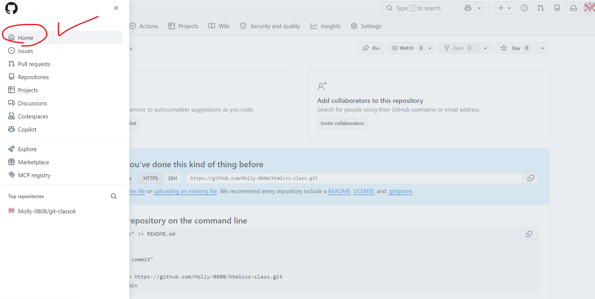
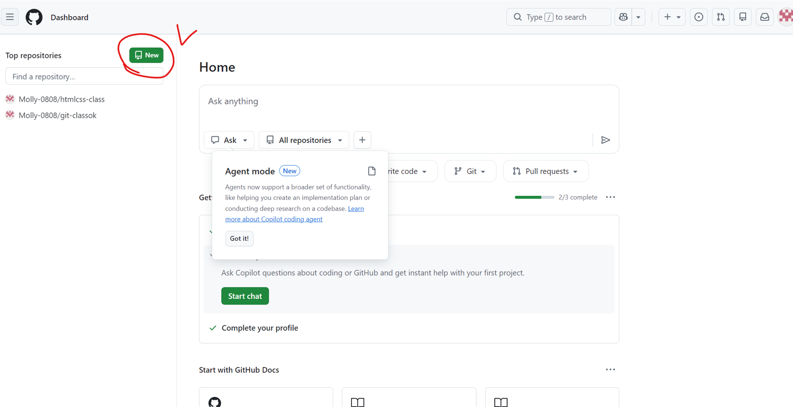
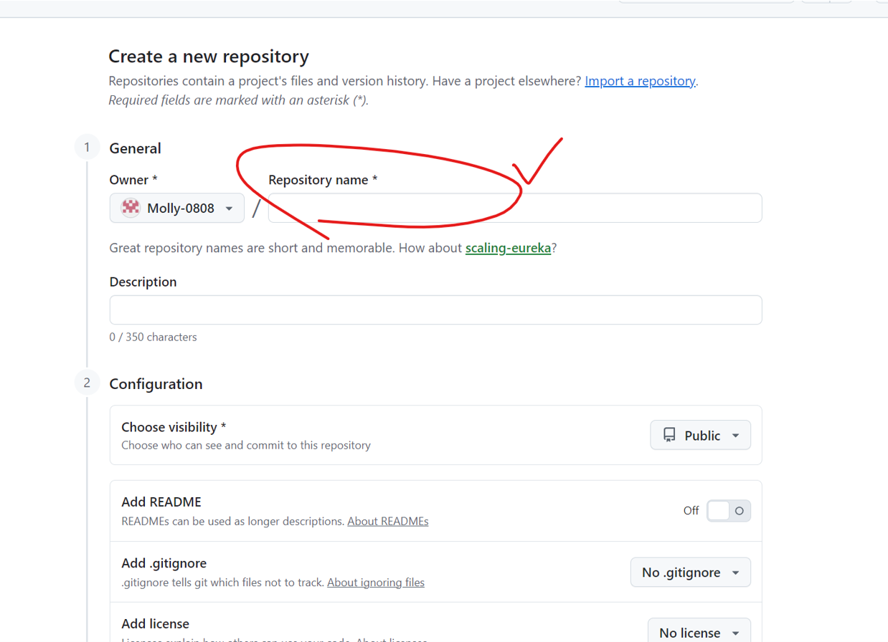
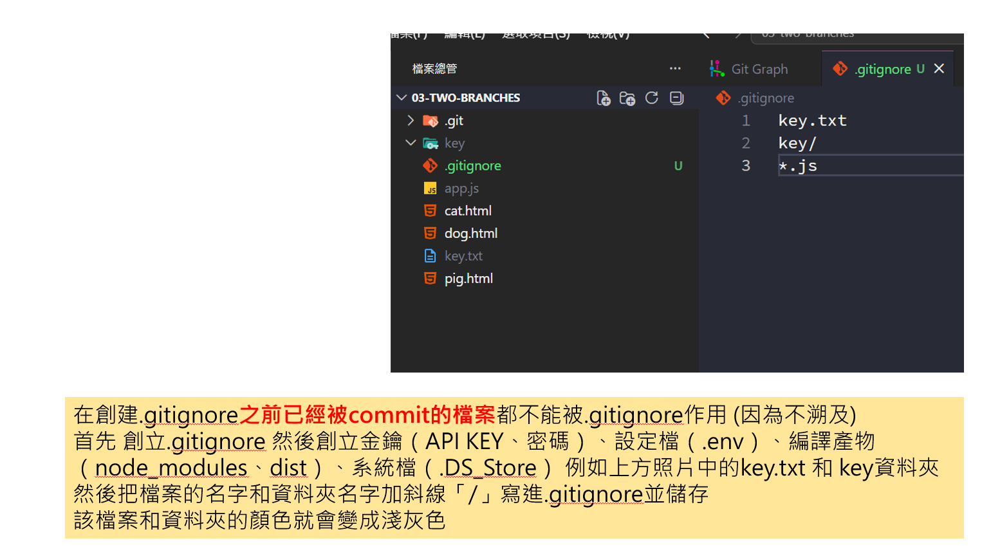
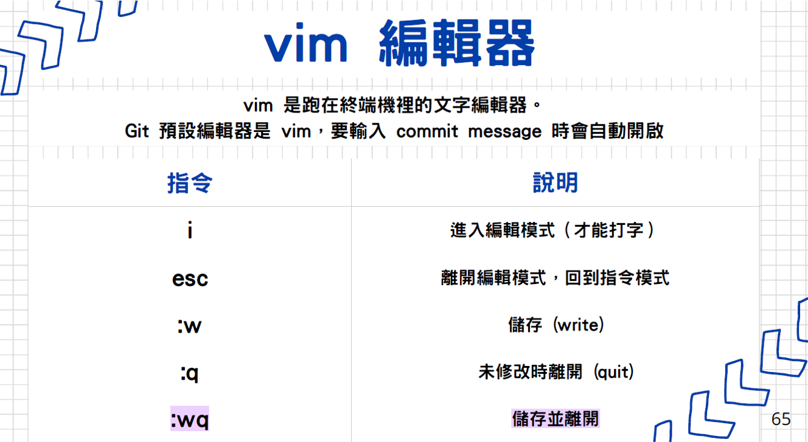
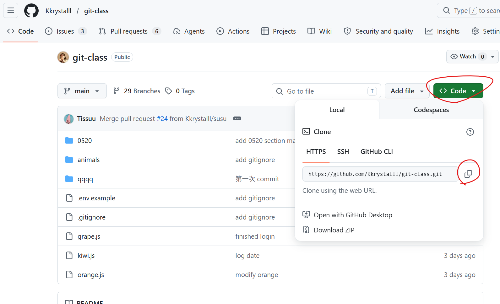

# Git 技術筆記

- [Git 技術筆記](#git-技術筆記)
  - [練習題網址和檔案](#練習題網址和檔案)
  - [git config](#git-config)
    - [基本設定](#基本設定)
    - [用 git config 設定指令的縮寫](#用-git-config-設定指令的縮寫)
    - [用 git config 設定今後的 master 都自動變成 main](#用-git-config-設定今後的-master-都自動變成-main)
  - [git init](#git-init)
    - [如何建立 .git 資料夾](#如何建立-git-資料夾)
    - [如何取消 git init](#如何取消-git-init)
  - [git add 【從工作目錄加到暫存區】](#git-add-從工作目錄加到暫存區)
    - [如何 git add](#如何-git-add)
    - [如何取消 git add](#如何取消-git-add)
  - [git commit 【從暫存區加到本地儲存庫】](#git-commit-從暫存區加到本地儲存庫)
    - [如何 commit](#如何-commit)
    - [如何取消 commit](#如何取消-commit)
  - [查看紀錄相關指令](#查看紀錄相關指令)
    - [git status](#git-status)
    - [git blame](#git-blame)
    - [git log](#git-log)
    - [git branch](#git-branch)
    - [git reflog](#git-reflog)
    - [git remote](#git-remote)
  - [git branch](#git-branch-1)
    - [git switch](#git-switch)
    - [git checkout](#git-checkout)
    - [detached HEAD 斷頭狀態](#detached-head-斷頭狀態)
  - [git push](#git-push)
    - [推送的前置作業](#推送的前置作業)
    - [正式推送](#正式推送)
  - [.gitignore](#gitignore)
    - [那 API KEY 放哪?](#那-api-key-放哪)
  - [git reset](#git-reset)
  - [git merge](#git-merge)
    - [如何 git merge](#如何-git-merge)
    - [如何取消 git merge](#如何取消-git-merge)
    - [vim 編輯器](#vim-編輯器)
  - [git rebase](#git-rebase)
    - [如何 git rebase](#如何-git-rebase)
    - [如何取消 git rebase](#如何取消-git-rebase)
  - [git clone](#git-clone)
  - [git fetch](#git-fetch)
  - [git pull](#git-pull)
  - [GitHub 多人協作](#github-多人協作)
    - [開 issues](#開-issues)
    - [PR (Pull requests)](#pr-pull-requests)
    - [解衝突](#解衝突)
  - [git stash](#git-stash)
  - [git cherry-pick](#git-cherry-pick)

## 練習題網址和檔案

題庫：https://hackmd.io/IbWp68diQGiy8x-9yBmPlw?view#Git-reset-amp-reflog-%E7%B7%B4%E7%BF%92

檔案：https://drive.google.com/drive/u/0/folders/1P5agqEJUM2Lac6sC2k4e6Q7dafb8uJUG

## git config

### 基本設定

1. 開啟 VS Code 內建終端機：按 Ctrl ` (Tab 上面那)
2. 檢查git設定值：$`git config --lis`
3. 設定user.name：$`git config --global user.name "我的名`
4. 設定user.email：$`git config --global user.email "我的信箱"`

>     有傳遞 --global參數，只需操作一次

### 用 git config 設定指令的縮寫

- $`git config --global alias.別名nnn "原指令log --oneline --author"`
  - 縮寫變：$`git nnn`

### 用 git config 設定今後的 master 都自動變成 main

- $`git config --global init.defaultBranch main`

返回[Git 技術筆記](#git-技術筆記)

## git init

### 如何建立 .git 資料夾

1. 在電腦建立新夾
2. 直接開啟 VS Code 新視窗，拖拉新資料夾進入 VS Ce
3. 開啟 VS Code 內建終端機：按 Ctrl ` (Tab 上面那)
4. 生成 .git 資料夾：$`git in`
5. 確認版本號：$`git --version `

### 如何取消 git init

- 使用 VS Code 內建終端機
  - 輸入$`Remove-Item -Recurse -Force .git`

- 手動刪除
  - 開啟 VS Code 檔案總管，直接刪除 .git 資料夾

返回[Git 技術筆記](#git-技術筆記)

## git add 【從工作目錄加到暫存區】

### 如何 git add

- 加入某個檔案：$`git add aaa.md`

- 加入某個資料夾(內的所有檔案)：$`git add 資料夾名稱/`

- 加入某個資料夾內的某個檔案：$`git add 資料夾名稱/aaa.md`

- 加入目前所有資料夾內全部有新增或修改過的檔案：$`git add .`(點點前要有空格)

- 一次性加入特定多個檔案：$`git add aaa.md bbb.md ccc.md`(檔案中間空格即可)

>     git add 不會加入資料夾，只會加入「檔案」，所以如果命令輸入資料夾，代表加入該資料夾內的所有檔案

### 如何取消 git add

- 從暫存區移除某個檔案：$`git restore --staged aaa.md`
  - 舊式/傳統指令，效果同上：$`git reset aaa.md`

- 清空暫存區：$`git restore --staged .`

返回[Git 技術筆記](#git-技術筆記)

## git commit 【從暫存區加到本地儲存庫】

### 如何 commit

- 儲存檔案：$`git commit -m "第一次commit"`
  - git add 後 commit 的東西就是剛才 add 過的檔案

- 修改最新commit的備註訊息(SHA值會變)：$`git commit --amend -m "有錯字可改"`

- 把所有「已修改」和「已刪除」的檔案 add 並 commit：$`git commit -a -m "跳過暫存區直接儲存囉"`

### 如何取消 commit

如果已經commit過，需要修改檔案，只要重新add再commit就好

返回[Git 技術筆記](#git-技術筆記)

## 查看紀錄相關指令

### git status

- 用於察看以下檔案情況：
  - 查看「未追蹤的檔案」：新建立的檔案還沒add，顯示紅色

  - 查看「已修改但尚未暫存」：已經追蹤過，但因為有修改過，還沒重新add，顯示紅色

  - 查看「準備提交的變更」：已經add，在暫存區排隊，顯示綠色

### git blame

- 查看每一行最後修改者、提交時間：$`git blame`

### git log

- 查看commit歷史紀錄：$`git log`

- 單行顯示commit歷史紀錄：$`git log --oneline`

- 限制顯示幾個commit歷史紀錄：$`git log -n 3`

- 查看包含branch的走向：$`git log --graph`

- 查看完整修改內容：$`git log -p`

- 查看特定人的commit：$`git log --oneline --author="想查的名字"`
  - =和後面的”人名”之間不能有空格，且人名呈現灰色是正常的

- 查看特定字的commit：$`git log --oneline --grep="想查的字"`

- 查看特時間區間的commit：$`git log --since="2026-04-14 09:00" --until="2026-04-14 17:30"`

### git branch

- 查看目前 (本機) 有哪些 branches：$`git branch`

- 查看所有 branch 包含遠端(all)：$`git branch -a`

返回[Git 技術筆記](#git-技術筆記)

### git reflog

git reflog 記錄「滑鼠與鍵盤操作 Git 的歷史」，通常會保留 30 到 90 天。

- 每一次 HEAD 移動：$`git reflog`

- 看某個分支的移動紀錄：$`git reflog 分支名`

- 顯示最近 5 筆：$`git reflog -n 5`

- 在什麼時間點，讓 HEAD 做了什麼變動：$`git reflog --date=local`

### git remote

- 列出所有遠端倉庫的簡稱：$`git remote`

- 顯示遠端倉庫的簡稱及其對應的詳細 URL：$`git remote -v`

返回[Git 技術筆記](#git-技術筆記)

## git branch

- 在現在位置建立名為 momo 的分支：$`git branch momo`

- 刪除名為 momo 的分支：$`git branch -d momo`

- 強制刪除名為 momo 的分支：$`git branch -D momo`

- 重新命名分支：$`git branch -m 新分支名`

- 強制重新命名分支：$`git branch -M 新分支名`

- 在指定的 commit（SHA）位置建立一個新的分支：$`git branch 分支名 SHA值`

### git switch

- 將 HEAD(我的編輯位置) 移到指定的分支：$`git switch 指定分支名`

- 建立新分支並把位置切換去新分支：$`git switch -c 分支名`

- 切換位置回上一個分支：$`git switch -`

- 切換位置到指定 commit（進入斷頭 detached HEAD）：$`git switch --detach SHA值`

### git checkout

- 將 HEAD(我的編輯位置) 移到指定的分支：$`git checkout 指定分支名`

- 建立新分支並把位置切換去新分支：$`git checkout -b 分支名`

- 切換位置回上一個分支：$`git checkout -`

- 切換位置到指定 commit（進入斷頭 detached HEAD）：$`git checkout SHA值`

- 僅單一檔案內容恢復成指定 commit 的版本：$`git checkout SHA值 aaa.md`

返回[Git 技術筆記](#git-技術筆記)

### detached HEAD 斷頭狀態

>     情況：我不小心checkout到某個SHA值上並且變動檔案，已經add和commit，等於我在不屬於我的branch上commit了(就是我根本沒有在任何branch上commit)。

如果我想保留剛剛的修改，並安全回到 main，解決辦法：

強制將 main 分支的標籤移動到新做好的 SHA 值上：$`git branch -f main 新SHA值`

這時 main 已經移過來了，但我還在斷頭狀態，需切回 main 分支 ：$`git checkout main`

返回[Git 技術筆記](#git-技術筆記)

## git push

### 推送的前置作業

如何開新的 GitHub 儲存庫：







- 在本地加入遠端 GitHub 儲存庫並取名字：$`git remote add 儲存庫名 儲存庫網址`
  - 網址在GitHub那邊

  - 儲存庫名預設是 origin ，可自己改別的名字。

1. 單次把 master 變成 main：$`git branch -M main`

2. 首次推送本地分支 main 到遠端儲存庫 origin，並設定上游分支的對應：$`git push -u 儲存庫名origin 本地分支main`

>     設定上游分支的對應是指 -u，即 --set-upstream 的縮寫。

- 儲存庫重新命名：$`git remote rename 舊名 新名`

### 正式推送

- 推送預設分支到預設的遠端儲存庫：$`git push`

- 推送分支到遠端儲存庫：$`git push 儲存庫名origin 分支名main`

- 強制推送：$`git push 儲存庫名origin 分支名main -f`

- 本地的某分支推到遠端的某分支 (名字相同時可省略)：$`git push 儲存庫名origin 本地分支名:遠端分支名`
  - 例如：git push origin feature:feature 可簡寫為 git push origin feature

- 刪除遠端分支：$`git push 儲存庫名origin :遠端分支名`
  - 冒號前面要留空格，因為冒號前面原本是本地分支的位置，但現在空著，等於是用「空無一物」覆蓋遠端分支，結果就是把該遠端分支刪除了。

返回[Git 技術筆記](#git-技術筆記)

## .gitignore

指定哪些檔案不要被 Git 版控，例如：金鑰（API KEY、密碼）、設定檔（.env）、編譯產物（node_modules、dist）、系統檔（.DS_Store）



- 把已經 commit 過但後來發現不需要追蹤的檔案從 Git 庫中剔除，並且不刪除檔案：$`git rm --cached 檔名`

### 那 API KEY 放哪?

- .env（環境變數檔）：只存在於本機電腦，在檔案裡寫真的 API KEY、資料庫密碼。

- .env.example（範本檔）：只寫欄位名稱（例如 API_KEY= 留空），不寫真實密碼，給新加入專案的人看到底有多少密碼種類，再去跟建立專案的人要密碼。

返回[Git 技術筆記](#git-技術筆記)

## git reset

讓分支 Git 回到過去某一刻，順便決定要不要保留修改。

至少要有兩次commit才可以做到「回到上一個commit」。

- 回到過去的某個 commit（預設--mixed）：$`git reset SHA值`
  - 所有異動的檔案變回 unstaged（add 前）：$`git reset --mixed SHA值`

  - 所有異動的檔案變回 staged（add 後）：$`git reset --soft SHA值`
  - 所有異動的檔案全部還原（謹慎使用）：$`git reset --hard SHA值`

>     mixed和soft不會刪掉檔案和修改，但是hard會刪掉。

- 從暫存區移除某個檔案(舊式/傳統指令)：$`git reset aaa.md`
  - 新式，效果同上：$`git restore --staged aaa.md`

- 回到上一個 commit （^ 代表往上一層）：$`git reset HEAD^`

- 回到前 3 個 commit（~n 代表往前 n 步）：$`git reset HEAD~3`

- 回到某 commit 的上一步：$`git reset SHA值^`

- 回到某 commit 的前幾步：$`git reset SHA值~3`

返回[git-reflog](#git-reflog)

返回[Git 技術筆記](#git-技術筆記)

## git merge

將另一個分支的變更合併進「我目前所在的分支」。

1. 快進式合併 (Fast-Forward)：不增加新的 Commit，直接把進度指標往前推進到目標分支的最新位置，不會生成新的節點。
   - 情況：momo分支有新的 commit ，main分支沒有。

2. 三方合併 (3-way Merge)：兩邊都有新進度，Git 找出共同祖先並融合雙方修改，自動生成一個新的合併節點。
   - 情況：momo分支和main分支都有新的 commit 。

### 如何 git merge

- 將momo分支合併到目前所在的分支：$`git merge momo`

>     git merge momo 的效果是 HEAD 會在目前所在分支上，並且會排在最上面。

- 優先使用快進：$`git merge -ff 分支名`
  - -ff 代表 Fast-Forward（快進）

- 強迫 Git 建立一個新的節點：$`git merge --no-ff 分支名`

- 強迫 Git 建立一個新的節點，並指定訊息（不會進到 vim 編輯器）：$`git merge --no-ff -m "commit訊息" 分支名`

### 如何取消 git merge

- 取消 merge（發生衝突時）：$`git merge --abort`

返回[Git 技術筆記](#git-技術筆記)

### vim 編輯器

vim 是跑在終端機裡的文字編輯器。

當遇到會產生新節點的Y字型情況，執行完 $`git merge 分支名` 之後，會跳出問我要不要改備註訊息的vim編輯器，如果我想改就先打小寫 i 進入編輯模式，改好之後按esc退出編輯，再打 :wq 就能做到儲存並離開。



返回[Git 技術筆記](#git-技術筆記)

## git rebase

複製目前的進度，剪貼到目標分支的最新 Commit 後面，讓歷史紀錄變成一條乾淨的直線。

舉例：

```
         ┌── C1 ── C2 (你的 dev 分支)
         │
(main) ─── A ─── B (目標 main 分支)
```

在 dev 分支執行 git rebase main 之後......

```
(main) ─── A ─── B ─── C1' ─── C2'
```

### 如何 git rebase

- 將目前分支嫁接到momo分支之後：$`git rebase momo`

- 解決衝突後，繼續解下一個 commit 的衝突：$`git rebase --continue`

>     絕對不要對「已經推送到遠端（GitHub）」的 Commit 執行 Rebase，因為 Rebase 是「複製並刪除舊節點」，會改變 Commit 的 SHA 值。

### 如何取消 git rebase

- 取消 rebase：$`git rebase --abort`

- 跳過解當前 commit 的衝突：$`git rebase --skip`

返回[Git 技術筆記](#git-技術筆記)

## git clone

把遠端 repository 複製一份到本地（把 GitHub 專案整包抓到本地來用）。

git clone 會做的事情：

- 下載整個專案
- 自動建立 .git
- 自動設定遠端 origin

指令：$`git clone <repo-url>`

1. 開電腦終端機
2. 然後cd到資料夾或桌面
3. 再輸入 git clone <repo-url> (網址在GitHub)
4. 開 VS Code 把資料夾抓進去就成功啦



返回[Git 技術筆記](#git-技術筆記)

## git fetch

抓取遠端最新資料，但不會影響目前檔案。

HEAD 不會移動，目前工作中的分支也不會改變。

git fetch 會做的事情：

- 更新遠端分支
- 不會改你的程式碼

從遠端儲存庫下載某分支到本地電腦：$`git fetch 儲存庫名 分支名`

> 記得把 Show Remote Brench 打勾才看得到遠端分支。

返回[Git 技術筆記](#git-技術筆記)

## git pull

返回[Git 技術筆記](#git-技術筆記)

## GitHub 多人協作

### 開 issues

### PR (Pull requests)

### 解衝突

返回[Git 技術筆記](#git-技術筆記)

## git stash

返回[Git 技術筆記](#git-技術筆記)

## git cherry-pick

返回[Git 技術筆記](#git-技術筆記)
