# JavaScript 技術筆記

- [JavaScript 技術筆記](#javascript-技術筆記)
  - [for 迴圈](#for-迴圈)
  - [補字 if...else if... / .padStart(總長度, "想補的字")](#補字-ifelse-if--padstart總長度-想補的字)
  - ["想印的字".repeat()](#想印的字repeat)
  - [function 函式](#function-函式)
  - [Array 陣列](#array-陣列)
    - [unshift / push / shift / pop](#unshift--push--shift--pop)
    - [splice()](#splice)
    - [concat](#concat)
  - [forEach / filter / map / reduce / every / some 陣列高階函式](#foreach--filter--map--reduce--every--some-陣列高階函式)
    - [filter / map / reduce 綜合練習](#filter--map--reduce-綜合練習)
  - [物件](#物件)
  - [DOM：querySelector等多種方法](#domqueryselector等多種方法)
    - [更多DOM操作：](#更多dom操作)
      - [createElement() / textContent / appendChild()：](#createelement--textcontent--appendchild)
      - [remove() / removeChild()：](#remove--removechild)
      - [parentElement / children：](#parentelement--children)
      - [previousElementSibling / nextElementSibling：](#previouselementsibling--nextelementsibling)
      - [insertAdjacentElement("", ) / insertAdjacentHTML("", )：](#insertadjacentelement---insertadjacenthtml-)
    - [Event Flow 事件流程](#event-flow-事件流程)
    - [DOM 和 addEventListener() 監聽器 練習題](#dom-和-addeventlistener-監聽器-練習題)
      - [基礎練習](#基礎練習)
  - [ES6](#es6)
    - [「...」其餘參數](#其餘參數)
  - [setTimeout() / setInterval()](#settimeout--setinterval)
  - [抓取網路資料](#抓取網路資料)
    - [XMLHttpRequest()](#xmlhttprequest)
    - [fetch \& then](#fetch--then)
    - [new Promise / then \& catch / resolve \& reject](#new-promise--then--catch--resolve--reject)
    - [aynsc \& await / try \& catch](#aynsc--await--try--catch)
    - [CORS 錯誤](#cors-錯誤)
    - [Event Loop 事件循環](#event-loop-事件循環)
  - [jQuery](#jquery)
    - [安裝 jQuery](#安裝-jquery)
    - [jQuery 的基本用法](#jquery-的基本用法)
    - [jQuery.ajax()：](#jqueryajax)
  - [YouBike練習題](#youbike練習題)
    - [一般寫法](#一般寫法)
    - [用 jQuery 寫法改寫](#用-jquery-寫法改寫)
      - [Postman](#postman)
      - [Font Awesome](#font-awesome)
    - [課堂實作練習fetch和await(非 jQuery)](#課堂實作練習fetch和await非-jquery)
  - [module / export \& import](#module--export--import)
  - [npm / package.json](#npm--packagejson)
  - [axios](#axios)
  - [dayjs](#dayjs)
  - [Block Scope / function scope / lexical scope / closure / IIFE](#block-scope--function-scope--lexical-scope--closure--iife)
  - [`__proto__` / prototype / 原型打造 / 語法糖衣](#__proto__--prototype--原型打造--語法糖衣)
  - [this](#this)
  - [初階 TODO 列表製作](#初階-todo-列表製作)
  - [製作 TODO APP](#製作-todo-app)
  - [pass by reference / pass by value](#pass-by-reference--pass-by-value)
  - [recursive 遞迴](#recursive-遞迴)
  - [throw](#throw)
  - [TDD](#tdd)
    - [安裝 Jest](#安裝-jest)
    - [Regex (Regular Expression)](#regex-regular-expression)
  - [TDD 實作](#tdd-實作)
  - [進階練習 圖片輪播](#進階練習-圖片輪播)
  - [進階練習 倒數計時器](#進階練習-倒數計時器)

## for 迴圈

```js
// for 迴圈 印0到9的奇數

for (let i = 0; i < 10; i += 1) {
  if (i % 2 == 0) {
    console.log(i + 1);
  }
}
————————————————————————————————————————————
結果 1 3 5 7 9
```

```js
// for 迴圈 印出0到100的總和

let total = 0;
for (let i = 0; i <= 100; i += 1) {
  total += i; // 就是total = total + i
}
console.log(total);
————————————————————————————————————————————
結果 5050
```

```js
// for 迴圈 印出2到100的偶數的總和

let total = 0;
for (let i = 2; i <= 100; i += 2) {
  total += i; // 就是total = total + i
}
console.log(total);
————————————————————————————————————————————
結果 2550
```

```js
// for 迴圈 印出1到100的偶數的總和

let total = 0;
for (let i = 1; i <= 100; i += 1) {
  if (i % 2 == 0) {
    total += i;
  }
}
console.log(total);
————————————————————————————————————————————
結果 2550
```

```js
// while 迴圈 印出1到9

let i = 1;
while (i < 10) {
  console.log(i); // 先印出目前的數字
  i += 1; // 再把 i 加 1
}
————————————————————————————————————————————
結果 1 2 3 4 5 6 7 8 9
console.log(i) 和 i += 1 調換順序會變成2 3 ...9 10
```

```js
// 巢狀迴圈 印出三行田字且每行要有十個田字

for (let j = 0; j < 3; j += 1) {
  let text = "";
  for (let i = 0; i < 10; i += 1) {
    text += "田";
  }
  console.log(text);
}
————————————————————————————————————————————
結果
田田田田田田田田田田
田田田田田田田田田田
田田田田田田田田田田

外層迴圈 j 控制列數Row。
每一行開始前先準備一個空的字串text，用來收集這一行要印的「田」。
內層迴圈 i 控制每行的內容Column。
```

```js
// 巢狀迴圈 印出九九乘法表

for (i = 1; i <= 9; i++) {
  for (j = 1; j <= 9; j++) {
    console.log(`${i} * ${j} = ${i * j}`);
  }
}
————————————————————————————————————————————
結果
被乘數 * 乘數 = 計算結果
1 * 1 = 1 ~ 1 * 9 = 9
2 * 1 = 2 ~ 2 * 9 = 18
以此類推持續印出直到
9 * 1 = 9 ~ 9 * 9 = 81

外層迴圈 i 是被乘數; 內層迴圈 j 是乘數。
```

返回[JavaScript 技術筆記](#javascript-技術筆記)

## 補字 if...else if... / .padStart(總長度, "想補的字")

```js
// if...else if...else... 數字補零

let n = 3;
if (n < 10) {
  console.log("00" + n);
} else if (n < 100) {
  console.log("0" + n);
} else {
  console.log(n);
}
————————————————————————————————————————————
結果 003 因為88行n是3

個位數 n < 10
十位數 n < 100
百位數以上 else
```

```js
// 用ES8語法 .padStart(總長度, "想補的字") 數字補零

let n = 3;
let result = String(n).padStart(3, "0");
console.log(result);
————————————————————————————————————————————
結果 003 因為99行n是3

先用 String() 把數字 3 轉換成字串 "3"，
再用 .padStart(3, "0") 第一個參數 3 代表目標總長度。
```

返回[JavaScript 技術筆記](#javascript-技術筆記)

## "想印的字".repeat()

```js
// 用 "想印的字".repeat(i) 印出對齊左側的聖誕樹

for (let i = 1; i <= 5; i += 1) {
  console.log("*".repeat(i));
}
————————————————————————————————————————————
結果
*
**
***
****
*****
```

```js
// 用 "想印的字".repeat(i) 印出對齊左側的「奇數」聖誕樹

for (let i = 1; i <= 9; i += 1) {
  if (i % 2 != 0) {
    console.log("*".repeat(i));
  }
}
————————————————————————————————————————————
結果
*
***
*****
*******
*********
```

```js
// 用 "想印的字".repeat(i) 印出完整的聖誕樹

for (let i = 0; i < 5; i += 1) {
  let spaces = 4 - i;
  let stars = i * 2 + 1;
  console.log(" ".repeat(spaces) + "*".repeat(stars));
}
————————————————————————————————————————————
結果
    *         4 空格 + 1 星
   ***        3 空格 + 3 星
  *****       2 空格 + 5 星
 *******      1 空格 + 7 星
*********     0 空格 + 9 星
```

返回[JavaScript 技術筆記](#javascript-技術筆記)

## function 函式

```js
// 函式基本定義及呼叫方式

function sayhi() {
  console.log("Hello");
}
sayhi(); //呼叫函式
————————————————————————————————————————————
結果 Hello
```

```js
// 函式中的參數的用法

function sayhi(someone) {
  console.log("Hello" + someone);
}
sayhi("Molly");
————————————————————————————————————————————
結果 HelloMolly
```

```js
// 匿名函式表達式

const sayhi = function (someone) {
  console.log("Hello" + someone);
};
sayhi("Molly");
————————————————————————————————————————————
結果 HelloMolly
```

```js
// 箭頭函式

const sayhi = (someone) => {
  console.log("Hello" + someone);
};
sayhi("Molly");
————————————————————————————————————————————
結果 HelloMolly

如果只有一個參數，小括號可以省略
const sayhi = someone => { ... };

如果內容只有一行，大括號可以省略不寫
const sayhi = someone => console.log("Hello" + someone);

如果是回傳值甚至不用寫 return
```

```js
// 加法函式

function add(a, b) {
  console.log(a + b);
}
add(1, 2);
————————————————————————————————————————————
結果 3

多個參數a, b 可以放更多，記得用逗號隔開。
```

```js
// 計算BMI

BMI = Body Mass Index
公式 = 體重 / (身高公尺²)

function calcBMI(h, w) {
  console.log(w / ((h / 100) * (h / 100)));
}
calcBMI(160, 60);
————————————————————————————————————————————
結果 23.4375
```

```js
// 預設參數

function dog(a, b, c = 100) {
  console.log(a, b, c);
}
dog(10, 20);
————————————————————————————————————————————
結果 10 20 100

如果在呼叫函式時沒有給 c 數值， c 就會自動採用預設好的 100。
```

```js
// 回傳值 Return Value

function add(a, b) {
  return a + b;
}
const result = add(1, 2);
console.log(result);
————————————————————————————————————————————
結果 3
```

```js
// 用「放大、四捨五入、再縮小」來處理小數點位數

function myRound(a, b = 0) {
  const s = 10 ** b; // **是平方, b是多少平方
  const j = Math.round(a * s) / s;

  return j;
}
console.log(myRound(3.14159, 2));
console.log(myRound(3.14159, 3));
console.log(myRound(3.14159));
————————————————————————————————————————————
結果
3.14
3.142 因為第四位是5，Math.round會進位
3

Math.round()用來將數字四捨五入到最接近的整數。
```

```js
// 承上題 省略宣告變數j的寫法

function myRound(a, b = 0) {
  const s = 10 ** b;
  return Math.round(a * s) / s;
}
console.log(myRound(3.14159, 2));
console.log(myRound(3.14159, 3));
console.log(myRound(3.14159));
————————————————————————————————————————————
結果
3.14
3.142
3
```

```js
// 示範「函式是一等公民」的特性

function hey() {} //定義了一個空函式

function hi(a) {
  console.log(a);
}

hi(hey);
————————————————————————————————————————————
結果 ƒ hey() {}

將 hey 函式本身作為引數傳遞給 hi 函式的參數 a 。
```

```js
// 計算 BMI 並回傳四捨五入到小數點後兩位的數值

function bmiCalculator(height, weight) {
  let h = height / 100
  let bmi = weight / (h * h)

  下方兩種方法擇一去return
  // Math.round(bmi * 100) / 100 回傳數字
  // bmi.toFixed(2) 回傳字串

  return Math.round(bmi * 100) / 100
}

console.log(bmiCalculator(170, 70))
————————————————————————————————————————————
結果 24.22
```

```js
// 判斷閏年

function isLeapYear(year) {
  return (year % 4 === 0 && year % 100 !== 0)
  || year % 400 === 0
}

console.log(isLeapYear(2020))
console.log(isLeapYear(2021))
————————————————————————————————————————————
結果
true
false
```

返回[JavaScript 技術筆記](#javascript-技術筆記)

## Array 陣列

```js
// 陣列索引

const nums = ["x", "y", "z", "t", "u", "v"];
console.log(nums[1]);
console.log(nums[3]);
console.log(nums[5]);
console.log(nums[nums.length - 1]);
————————————————————————————————————————————
結果 y t v v

x...v的陣列索引是0...5。
x的座位是0，v的座位是5。
nums.length代表nums陣列的長度，也就是6。
```

```js
// 遍歷陣列

const arr = ["a", "b", "c", "d", "e"];
for (let i = 0; i < arr.length; i++) {
  console.log(arr[i]);
}
————————————————————————————————————————————
結果 a b c d e
```

### unshift / push / shift / pop

|      |           前           |                  後 |
| :--- | :--------------------: | ------------------: |
| 加入 | .unshift(想加入的名稱) | .push(想加入的名稱) |
| 抽出 |  .shift()括號內不用寫  |  .pop()括號內不用寫 |

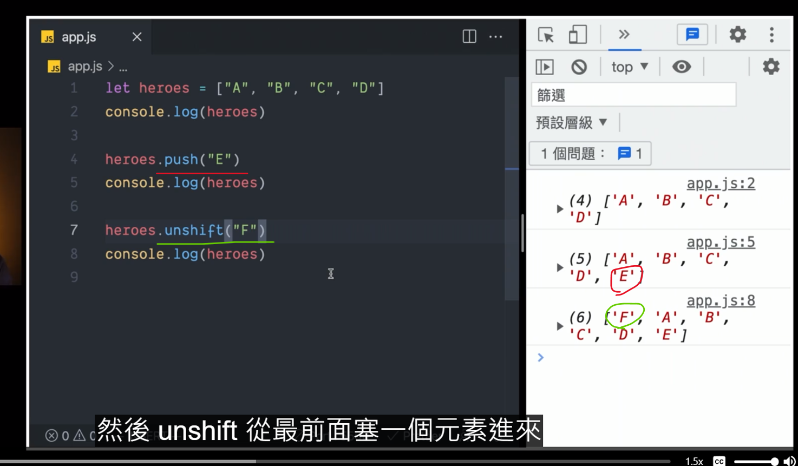

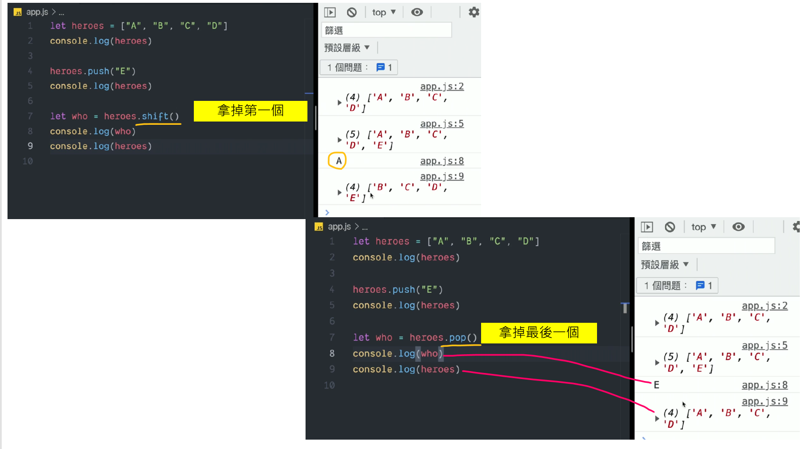

### splice()

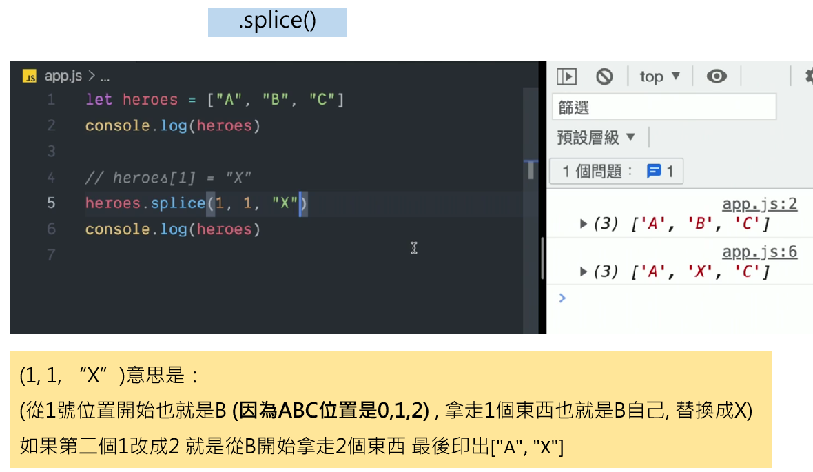

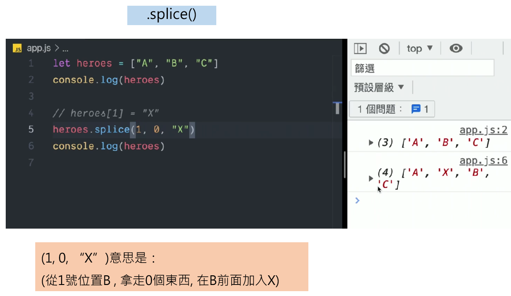

### concat

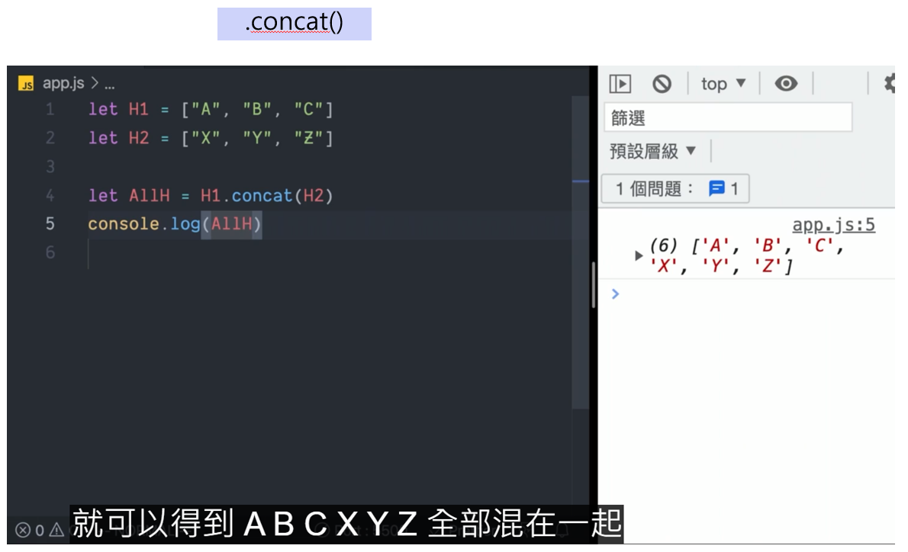

返回[JavaScript 技術筆記](#javascript-技術筆記)

## forEach / filter / map / reduce / every / some 陣列高階函式

```js
// forEach

const arr = ["a", "b", "c", "d", "e", "f"];
arr.forEach(function (i) {
  console.log(i);
});
————————————————————————————————————————————
結果 a b c d e f

forEach 只是單純執行動作，沒有回傳值（ 即 undefined ）。
```

```js
// 用 forEach 印出可以被 2 整除的元素

const nums = [1, 2, 3, 4, 5, 6, 7, 8, 9, 10];
nums.forEach(function (i) {
  if (i % 2 == 0) {
    console.log(i);
  }
});

用箭頭函式簡寫：
nums.forEach((i) => {...})
————————————————————————————————————————————
結果 2 4 6 8 10
```

```js
// push 搭配空陣列和forEach

const nums = [1, 2, 3, 4, 5, 6, 7, 8, 9, 10];
const result = [];
nums.forEach((i) => {
  if (i % 2 === 0) {
    result.push(i); //發現偶數時手動「推入」空陣列
  }
});
console.log(result);
————————————————————————————————————————————
結果 [2, 4, 6, 8, 10]
```

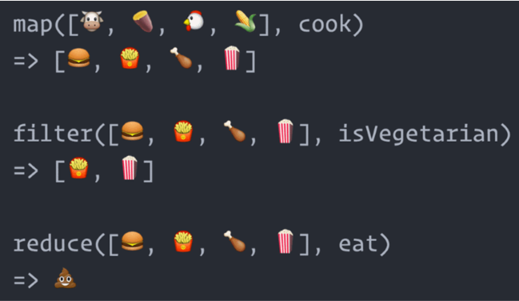

```js
// filter

const nums = [1, 2, 3, 4, 5, 6, 7, 8, 9, 10];
const result = nums.filter((el) => {
  if (el % 2 == 0) {
    return true;
  }
});
console.log(result);

直接回傳判斷式的簡寫：
const nums = [1, 2, 3, 4, 5, 6, 7, 8, 9, 10];
const result = nums.filter((el) => {
  return el % 2 == 0;
});
console.log(result);

用箭頭函式簡寫：
const nums = [1, 2, 3, 4, 5, 6, 7, 8, 9, 10];
const result = nums.filter(el => el % 2 == 0);
console.log(result);
————————————————————————————————————————————
結果 [2, 4, 6, 8, 10]

filter保持原始資料完整，所以一開始給它陣列，回傳也會是陣列。
filter做篩選，把錯的過濾掉，滿足條件的才會被留下來。
0 是 Falsy (假值)，非 0 是 Truthy (真值)。
```

```js
// map

const nums = [1, 2, 3, 4, 5];
const result = nums.map((el) => {
  return el * 2;
});
console.log(result);
————————————————————————————————————————————
結果 [2, 4, 6, 8, 10]

map也會保持原始資料完整，所以一開始給它陣列，回傳也會是陣列。
map會把東西整理運算後丟入新陣列。
map的本質是「對應、加工」與filter「過濾」不同，
所以 map 強制要求「原陣列有幾個，新陣列就有幾個」。
```

```js
// reduce

const nums = [1, 2, 3, 4, 5];
const result = nums.reduce((a, b) => {
  return a + b;
}, 0);
console.log(result);
————————————————————————————————————————————
結果 15

reduce將整個陣列的元素「歸納」成一個單一的值。
a 累積值， b 每回合的值， 0 起始值。
如果沒有起始值，會默認第一個b值為起始值。
```

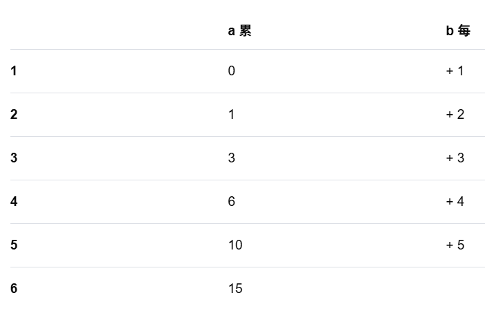

```js
// every() 全選才算對

const scores = [70, 85, 90];
const allPassed = scores.every(function (score) {
  return score > 60;
});
console.log(allPassed);
————————————————————————————————————————————
結果 true
```

```js
// some() 只要一個對就行

const fruits = ["apple", "banana", "cherry"];
const hasStrawberry = fruits.some((fruit) => fruit === "strawberry");
console.log(hasStrawberry);
————————————————————————————————————————————
結果 false
```

### filter / map / reduce 綜合練習

```js
// 印出 1 ~ 10 之間所有的奇數的平方和

const nums = [1, 2, 3, 4, 5, 6, 7, 8, 9, 10];
const j = nums.filter((n) => n % 2 != 0); //篩選奇數
const s = j.map((n) => n * n); //對奇數們平方
const total = s.reduce((a, b) => a + b); //全加起來
console.log(total);


簡寫A的未整理版：
const nums = [1, 2, 3, 4, 5, 6, 7, 8, 9, 10];
const total = nums.filter((n) => n % 2 != 0).map((n) => n * n).reduce((acc, n) => acc + n);
console.log(total);

簡寫A：
const nums = [1, 2, 3, 4, 5, 6, 7, 8, 9, 10];
const total = nums
  .filter((n) => n % 2 != 0)
  .map((n) => n * n)
  .reduce((acc, n) => acc + n);
console.log(total);

簡寫B： //odd奇數 square平方
const nums = [1, 2, 3, 4, 5, 6, 7, 8, 9, 10];
const isOdd = (n) => n % 2 != 0;
const square = (n) => n * n;
const add = (acc, n) => acc + n;
const total = nums.filter(isOdd).map(square).reduce(add);
console.log(total);
————————————————————————————————————————————
結果 165
```

```js
// 陣列解構

const heroes = ["A", "B", "C", "D"];
let [h1, h2] = heroes;
console.log(h1, h2);
————————————————————————————————————————————
結果 A B
```

返回[JavaScript 技術筆記](#javascript-技術筆記)

## 物件

```js
// 物件解構

const obj = { name: "cc", age: 18, a: 2 }

// const name = obj.name
// const age = obj.age
// const a = obj.a

const { a, age, name, x } = obj

console.log(a, age, name, x)
————————————————————————————————————————————
結果 2 18 "cc" undefined
```

```js
// 練習：

// 先用 forEach 列出每個name
const a = [
  { name: "cc", age: 1 },
  { name: "dd", age: 1 },
  { name: "ee", age: 1 },
];
a.forEach((i) => {
  console.log(i.name);
});

// 再用物件解構取代 i.name
a.forEach(({ name }) => {
  console.log(name);
});

// 省略大括號
a.forEach(({ name }) => console.log(name));
————————————————————————————————————————————
結果 cc dd ee
```

```js
// 物件

key vs value
例如下方name就是key， 1 就是 value。
物件就像是一個「置物櫃」，每個抽屜都有自己的key，
可以透過a["name"]和a.name這兩種方式打開抽屜：

const a = { name: 1, age: 2 };
console.log(a["name"]);
console.log(a.name);
————————————————————————————————————————————
結果 1
```

## DOM：querySelector等多種方法

HTML 本身只是純文字檔案，JavaScript 無法直接與之互動。DOM 就像是一個介面或橋樑，讓我做到：

- 查詢：querySelector。
- 建立：createElement。
- 刪除：remove()。
- 監聽：addEventListener。

```js
// getElement
document.getElementById("idname");
document.getElementsByClassName("classname");
// querySelector
document.querySelector("#idname");
document.querySelector(".classname");
document.querySelectorAll();
```

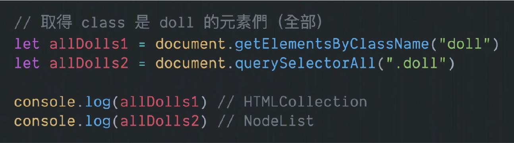

### 更多DOM操作：

#### createElement() / textContent / appendChild()：

```js
const hello = document.querySelector("#hello");
左邊hello是自己取名的JS的變數名稱;
右邊的hello是去HTML找的ID名稱;

const h = document.createElement("h1");
// 創造一個h1

h.textContent = "hi~";
// 加入h1標籤內容 <h1>hi~</h1>

const d = document.createElement("div");
// 再創造一個div

d.textContent = "I am div";
// 加入div標籤內容 <div>I am div</div>

h.appendChild(d);
// 在h(也就是h1)裡面的最後面加入d(也就是div)

hello.appendChild(h);
// 在hello(也就是最前面抓的id叫hello的容器)裡面的最後面加入h(也就是h1)
```

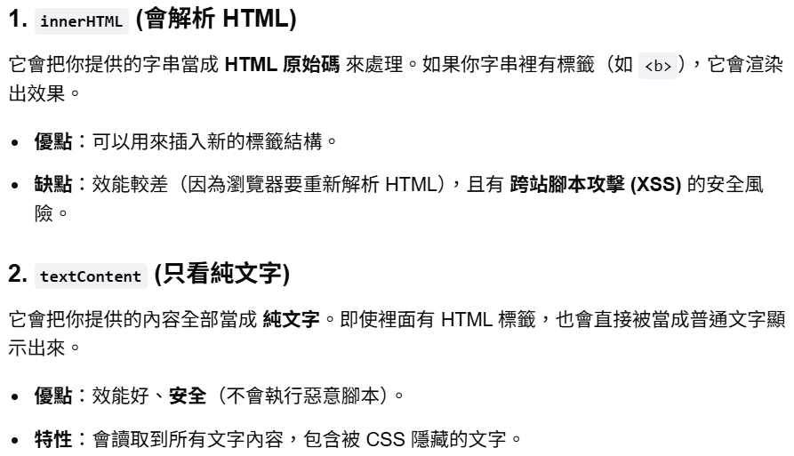

#### remove() / removeChild()：

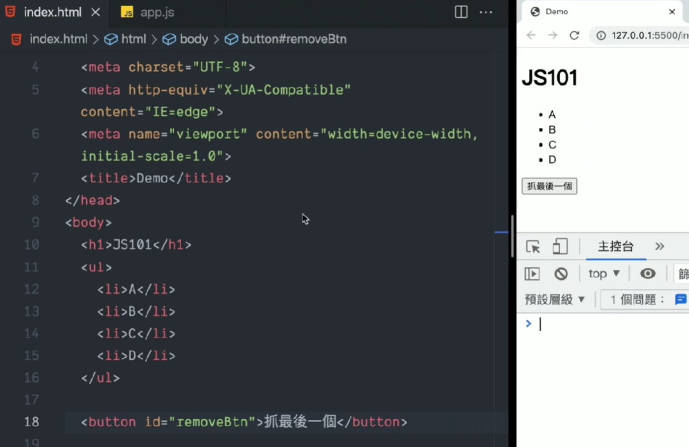

```js
// 用 remove() / removeChild() 拿掉ul的最後一個li

const btn = document.querySelector("#removeBtn");

btn.addEventListener("click", () => {
  const lastOne = document.querySelector("li:last-child");

  if (lastOne) {
    const u = document.querySelector("ul");
    u.removeChild(lastOne);
    // 另一個寫法是：拿掉上面這兩行，改成lastOne.remove();這行即可。
  }
});
```

#### parentElement / children：

```js
// 用 parentElement() 取得上層元素

const lastOne = document.querySelector("li:last-child")

取得上層 Element
console.log(lastOne.parentElement)

取得上層 Node
console.log(lastOne.parentNode)

// 建議用parentElement
```

```js
// 用 children 取得下層元素

const ul = document.querySelector("ul")

取得子層 Element
console.log(ul.children)

取得子層 Node
console.log(ul.childNodes)

// 建議用 children
```

#### previousElementSibling / nextElementSibling：

```js
// 用 previousElementSibling / nextElementSibling 取得兄弟姐妹元素
const li = document.querySelector("li:nth-child(2)");

// Element 系列
取得上一個;
console.log(li.previousElementSibling);

取得下一個;
console.log(li.nextElementSibling);

// Node 系列
取得上一個;
console.log(li.previousSibling);

取得下一個;
console.log(li.nextSibling);
```

#### insertAdjacentElement("", ) / insertAdjacentHTML("", )：

```js
// 用 insertAdjacentElement("位置", 變數或常數名稱) 在指定位置安插元素物件

const ul = document.querySelector("ul");

const li = document.createElement("li");
li.textContent = "X";

ul.insertAdjacentElement("afterend", li);
----------------------------------
// 用 insertAdjacentHTML("位置", 變數或常數名稱) 在指定位置安插HTML字串

const ul = document.querySelector("ul");

const li = "<li>Z</li>";

ul.insertAdjacentHTML("afterbegin", li);

// 建議用 insertAdjacentHTML
```

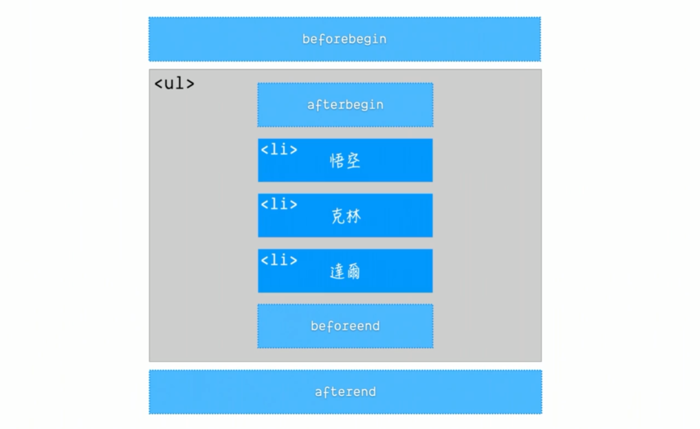

### Event Flow 事件流程

```js
- 捕獲階段 (Capture Phase)
- 目標階段 (Target Phase)
- 冒泡階段 (Bubbling Phase)

currentTarget：事件在哪發生的
```

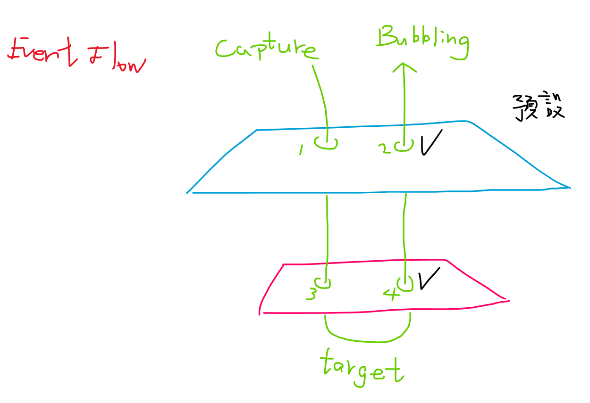

### DOM 和 addEventListener() 監聽器 練習題

#### 基礎練習

```html
html裡：

...
  <head>
...
    <title>Document</title>
    <script defer src="0413.js"></script>
  </head>
  <body>
    <button id="btn">123</button>
————————————————————————————————————————————
    <button id="Minus">-</button>
    <input type="text" id="nums" value="1" />
    <!-- 預設(value)是1 -->
    <button id="Plus">+</button>
————————————————————————————————————————————
    身高
    <input type="text" id="height" />
    <br />
    體重
    <input type="text" id="weight" />
    <br />
    結果
    <input type="text" id="bmi" />
    <button id="btn">計算</button>
    <!-- 注意!因為重複取名btn所以正式寫時上方三組不能同時存在 -->
  </body>
</html>
```

```js
// 點擊按鈕印出123

若在html的head裡的script後沒有加上延遲defer，就必須寫document.addEventListener("DOMContentLoaded", () => {});這串東西：

document.addEventListener("DOMContentLoaded", () => {
  const nums = document.querySelector("#btn");
  nums.addEventListener("click", () => {
    console.log(123);
  });
});
```

```js
// 如果按鈕目前的文字是 "123"就把它改成 "456"，否則就改回"123"

const nums = document.querySelector("#btn");
nums.addEventListener("click", () => {
  if (btn.textContent == "123") {
    // .textContent就是讀取HTML裡該位置的內容
    btn.textContent = "456";
  } else {
    btn.textContent = "123";
  }
});
```

```js
// 製作範圍限制 0 到 5 的計數器

let nums = document.querySelector("#nums");
let plus = document.querySelector("#Plus");
let minus = document.querySelector("#Minus");

plus.addEventListener("click", () => {
  if (nums.value < 5) {
    // nums.value = +nums.value + 1;
    // nums.value前面的加號的功能是強制將後面的字串轉型為數字
    nums.value = parseInt(nums.value) + 1;
    // parseInt()用於字串轉整數數字
  }
});
minus.addEventListener("click", () => {
  nums.value = nums.value - 1;
  if (nums.value - 1 < 0) {
    nums.value = 0;
  }
});
```

```js
// 製作BMI計算機

const btn = document.querySelector("#btn");
const bmi = document.querySelector("#bmi");
const height = document.querySelector("#height");
const weight = document.querySelector("#weight");

btn.addEventListener("click", () => {
  const h = Number(height.value) / 100;
  const w = Number(weight.value);
  // Number()把其他類型的資料（大多時候是字串）轉換成數字

  // bmi.value = w / h ** 2;
  const result = w / h ** 2;
  bmi.value = result.toFixed(2);
  // .toFixed() 取小數點後第幾位，括號裡寫數字表示取到第幾位;.要注意toFixed()算出來是字串。
});
```

```js
// 預設不要轉去超連結

const link = document.querySelector("#link");

// 監聽 click 事件，當發生的時候就...
link.addEventListener("click", function (e) {
  e.preventDefault(); // 把原本預設的行為停下來
  console.log("我被按了");
});
```

返回[JavaScript 技術筆記](#javascript-技術筆記)

## ES6

```js
// `${}`用法 示範字串拼接
let name = "悟空";
let age = 18;

// 用 + 號串接
console.log("大家好，我的名字是" + name + "，我今年" + age + "歲");

// 把變數帶進去
console.log(`大家好，我的名字是${name}，我今年${age}歲`);
```

```js
const name = hero.name
const age = hero.age
這兩行可以寫成這樣：
const {name , age} = hero
console.log(name, age)
```

### 「...」其餘參數

```js
// 把陣列組合起來 (和 concat 比較)

const H1 = ["A", "B", "C"]
const H2 = ["X", "Y", "Z"]

// const HAll = H1.concat(H2)
const HAll = [...H1, ...H2]

console.log(HAll)
————————————————————————————————————————————
結果 [ 'A', 'B', 'C', 'X', 'Y', 'Z' ]
```

```js
// 收集

function hi(a, b, c, ...others) {
    console.log(others)
}

hi(1, 2, 3, 4, 5)
————————————————————————————————————————————
結果 [4, 5]
```

```js
// 其餘參數語法

function hi(a, b, ...c) {
  console.log(a, b, c);
}
hi("x", "y", "z", "k");
————————————————————————————————————————————
結果 "x", "y", ["z", "k"]

「...」的作用是把「剩餘的所有參數」都收集起來，並自動包裝成一個陣列。
它只能擺在最後面，表示剩下的參數我C全部都要，若擺在其他位置會導致語法錯誤。
```

```js
// 「其餘參數」與「展開運算子」同時出現

function myLog(a, b, ...c) {
  console.log(a, b, ...c);
}
myLog(1, "a", 2, 3, "5", 7);
————————————————————————————————————————————
結果 1 "a" 2 3 "5" 7
```

```js
// 「其餘參數」與「陣列方法map」

function addOne(...a) {
  return a.map((i) => i + 1);
}
const result = addOne(1, 3, 5, 8, 10, 0, -1);
console.log(result);
————————————————————————————————————————————
結果 [2, 4, 6, 9, 11, 1, 0]
```

```js
// 承上題，用 typeof 過濾型態

function addOne(...a) {
  return a.filter((i) => typeof i == "number").map((i) => i + 1);
}
const result = addOne(1, 3, 5, 8, "a", 10, 0, -1, false);
console.log(result);
————————————————————————————————————————————
結果 [2, 4, 6, 9, 11, 1, 0]

使用.filter((i) => typeof i == "number")過濾，
"a" 的類型是 string，false 的類型是 boolean，兩者都會被剔除。
```

```js
// 陣列被當作單一參數傳進函式

const nums = [1, 2, 3, 4, 5];
function hi(a, b, c) {
  console.log(a, b, c);
}

hi(nums);
————————————————————————————————————————————
結果 [1, 2, 3, 4, 5] undefined undefined

因為只傳入一個東西（整個陣列），只有a拿到。
```

```js
// 承上題的解法：展開運算子並將陣列拆解為獨立的參數

const nums = [1, 2, 3, 4, 5];
function hi(a, b, c) {
  console.log(a, b, c);
}
hi(...nums); // 等於執行：hi(1, 2, 3, 4, 5)
————————————————————————————————————————————
結果 1 2 3
```

```js
// 函式共用

不論點擊 aa 還是 bb，都會跑同一個 h 函式。

// e.target
// e.currentTarget

這裡有省略抓資料的過程 沒寫出來
例如 document.querySelector("#aa")

const h = (e) => {
  console.log(e.target); // 在控制台印出使用者點擊了什麼
};
aa.addEventListener("click", h);
bb.addEventListener("click", h);
```

返回[JavaScript 技術筆記](#javascript-技術筆記)

## setTimeout() / setInterval()

```js
// 非同步
// stack堆疊: first in, last out(FILO)
// queue: first in, first out (FILO)

先放到旁邊排隊，程式不會在這裡停下來等 ，而是會繼續往下執行其他的程式碼， 3 秒鐘一到，瀏覽器才會跳回來執行 console.log(123)。

setTimeout(() => {
  console.log(123);
}, 3000);  //3000是三秒的意思
```

```js
// 循環執行 Interval間隔

每隔 3 秒鐘它就會在控制台印出一次 123，它不會停止，直到關閉網頁或手動叫停。

setInterval(() => {   //會一直印
  console.log(123);
}, 3000);
```

```js
// 製作自動累加計時器

let i = 0;
setInterval(() => {
  i = i + 1;
  console.log(i);
}, 1000);
```

```js
// 練習判斷

console.log(1);

setTimeout(() => {
  console.log(2);
}, 1000);
console.log(3);
————————————————————————————————————————————
結果 1 → 3 → (過一秒) → 2
```

返回[JavaScript 技術筆記](#javascript-技術筆記)

## 抓取網路資料

### XMLHttpRequest()

```js
//XMLHttpRequest()示範一

const api = "https://typicode.com";

const req = new XMLHttpRequest();

req.addEventListener("load", function () {
  const posts = JSON.parse(req.responseText);
});
req.open("GET", api);
req.send();

必較現代寫法fetch;
fetch(api)
  .then((res) => res.json())
  .then((posts) => console.log(posts));
```

```js
//XMLHttpRequest()示範二

const api = "https://jsonplaceholder.typicode.com/posts";

//建立網路傳送器 (XMLHttpRequest)
const req = new XMLHttpRequest();

req.addEventListener("load", () => {
  const posts = JSON.parse(req.responseText);
  posts.forEach((post) => {
    console.log(post);
  });
});

req.open("GET", api); // 準備用 GET 方式（拿取資料）去這個地址

req.send(); // 正式按下發送鈕
```

```js
//XMLHttpRequest()示範三:抓每一篇文章的title

const api = "https://jsonplaceholder.typicode.com/posts";

const req = new XMLHttpRequest();

req.addEventListener("load", () => {
  const posts = JSON.parse(req.responseText);
  posts.forEach((post) => {
    console.log(post.title);
  });
});

req.open("GET", api);

req.send();
```

### fetch & then

fetch 是一個非同步行為，它會回傳一個Promise。

fetch是瀏覽器提供的方法，不是JS提供的。

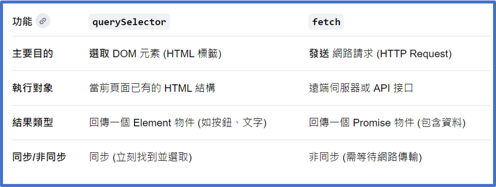

```js
//fetch示範一

const api = "https://jsonplaceholder.typicode.com/posts";

fetch(api)
  .then((resp) => {
    return resp.json();
  })
  .then((data) => {
    console.log(data);
  });
```

```js
//fetch示範二:抓每一篇文章的title

const api = "https://jsonplaceholder.typicode.com/posts";

fetch(api)
  .then((resp) => {
    return resp.json();
  })
  .then((data) => {
    data.forEach((d) => {
      console.log(d.title);
    });
  });
```

```js
// fetch 搭配 then 非同步抓取資料

結果 會抓到一個 Response 物件

fetch 抓回來的 x（回應值）就像是一個包裹：
-包含狀態碼（如 200 代表成功）
-包含標頭（Headers）
-真正的資料內容還在包裹裡面，需要用 .json() 方法解開

const url =
  "https://tcgbusfs.blob.core.windows.net/dotapp/youbike/v2/youbike_immediate.json";
const result = fetch(url);

result.then((x) => {
  console.log(x);
});
```

### new Promise / then & catch / resolve & reject

```js
// 建立一個 Promise 物件

Promise 的三種狀態：
-Pending (等待中)：初始狀態，還在跑 setTimeout 的那一秒。
-Fulfilled (已實現)：當我呼叫 resolve()，承諾成功。
-Rejected (已拒絕)：當我呼叫 reject()，承諾失敗。

new 是指我要做一個東西(也就是promise)出來。
resolve 和 reject 可以改別的名字。

const p1 = new Promise((resolve, reject) => {
  setTimeout(() => {
    resolve("ok123");
  }, 1000);
});
// 如果成功就跑 then，如果失敗就跑 catch。
p1.then((x) => {
  console.log(x);
}).catch((err) => {
  console.log(err);
});

如果要看到 .catch 運作：把 resolve 換成 reject
const p1 = new Promise((resolve, reject) => {
  setTimeout(() => {
    reject("出錯啦！");
  }, 1000);
});

p1.then(x => console.log(x))
  .catch(err => console.log(err)); // 1 秒後會印出 "出錯啦！"
————————————————————————————————————————————
結果 過 1 秒鐘控制台就會印出 "ok123"
```

### aynsc & await / try & catch

async 是「非同步」（Asynchronous） 的縮寫。

如果想在函式內使用await（用來等待 API 回傳資料），函式的前面一定要加上 async。

async 函式執行後會回傳一個 Promise 物件。

```js
const api = "https://jsonplaceholder.typicode.com/posts";

async function getPost() {
  const resp = await fetch(api);
  const posts = await resp.json();

  posts.forEach((post) => {
    console.log(post.title);
  });
}

getPost();
console.log("go!");
```

```js
// aynsc & await 承「建立一個 Promise 物件」題

await的行為（同步化寫法）
在 async & await 的世界裡不會使用 .then() 和 .catch() 這種「串接」的寫法，而是使用 try...catch 結構。

console.log(1);
try {
  const result = await p1;
  console.log(result);
} catch (err) {
  console.log(err);
}
console.log(2);
————————————————————————————————————————————
結果 1 -> (等一秒) -> ok123 -> 2

當程式執行到 const result = await p1; 時，它會「暫停」後續程式碼（即 console.log(2)）的執行。等到 1 秒鐘 Promise 變成 resolve 狀態後，拿到值並賦予給 result，才繼續往下執行。
```

比較 then & catch 寫法：

```js
// then & catch 承上題

then 的行為（非同步回呼）

console.log(1);
p1.then((x) => {
  console.log(x);
  console.log(2);
}).catch((err) => {
  console.log(err);
});
————————————————————————————————————————————
結果 1 → (過一秒) → ok123 → 2
```

### CORS 錯誤

```js
// CORS 錯誤

瀏覽器為了保護用戶安全而實施的一種安全攔截機制。
用瀏覽器F12抓不到資料但是用node可以因為node不是瀏覽器。

const url = "https://www.tenlong.com.tw/zh_tw/recent_bestselling?range=7";

const resp = await fetch(url);
const content = await resp.text();
console.log(content);
```

### Event Loop 事件循環

- 呼叫堆疊 (Call Stack)
- 等待區 (Web APIs)
- 微任務佇列 (Microtask Queue)
- 宏任務佇列 (Macrotask Queue)

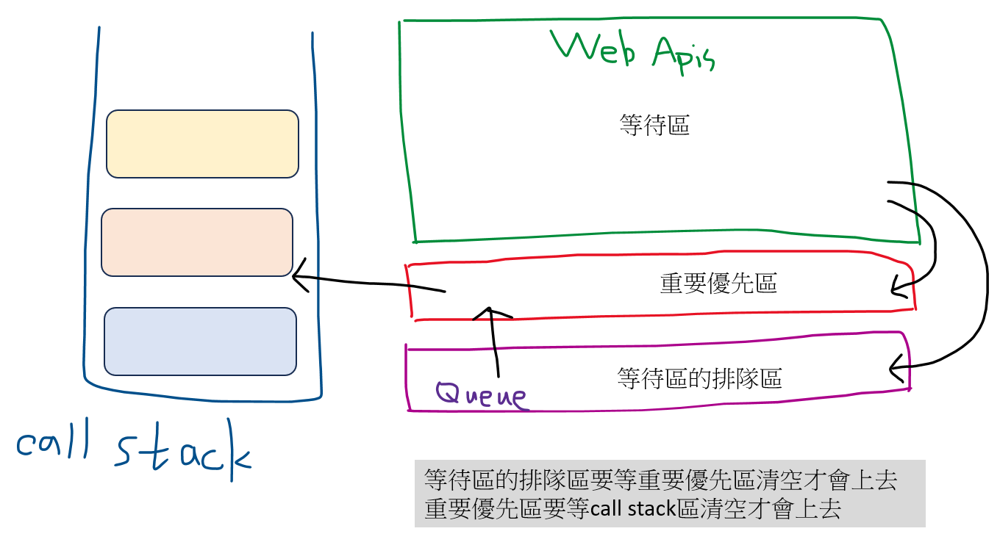

返回[JavaScript 技術筆記](#javascript-技術筆記)

## jQuery

### 安裝 jQuery

可以下載壓縮版：

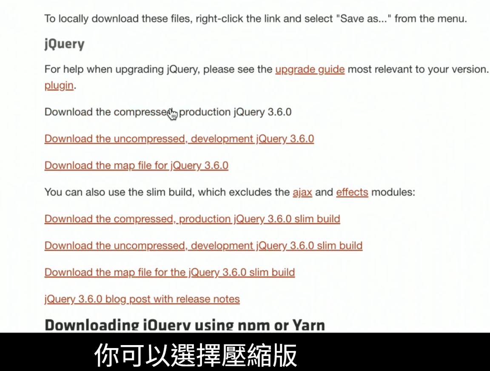

也可以選擇直接用CDN就好：

⬇️ https://jquery.com/download/

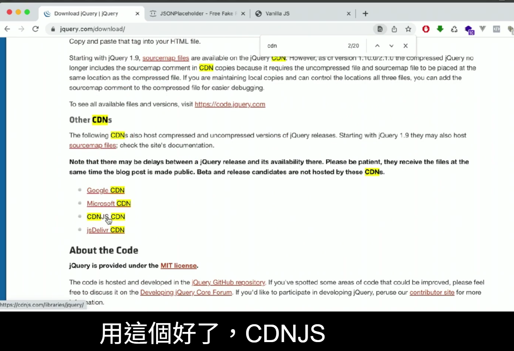

⬇️ https://cdnjs.com/libraries/jquery

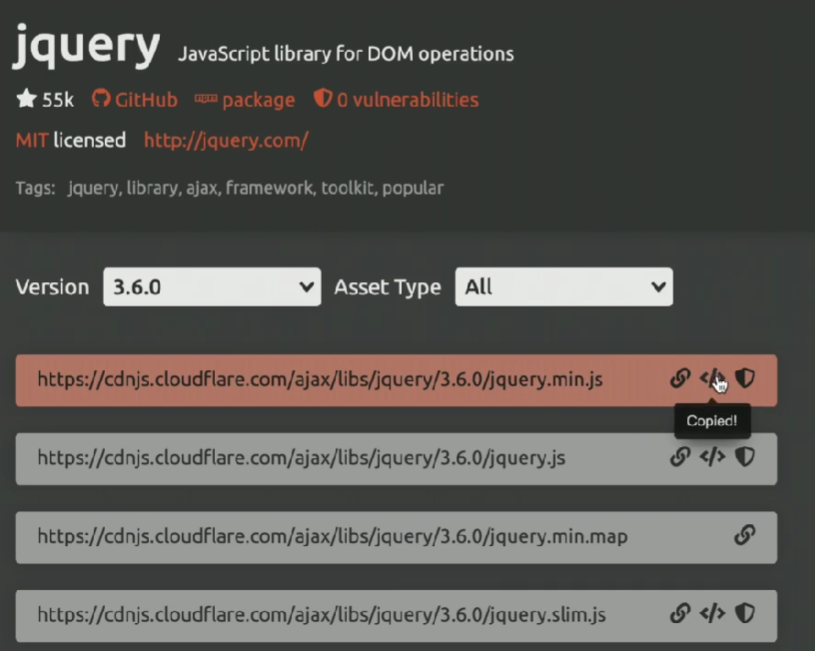

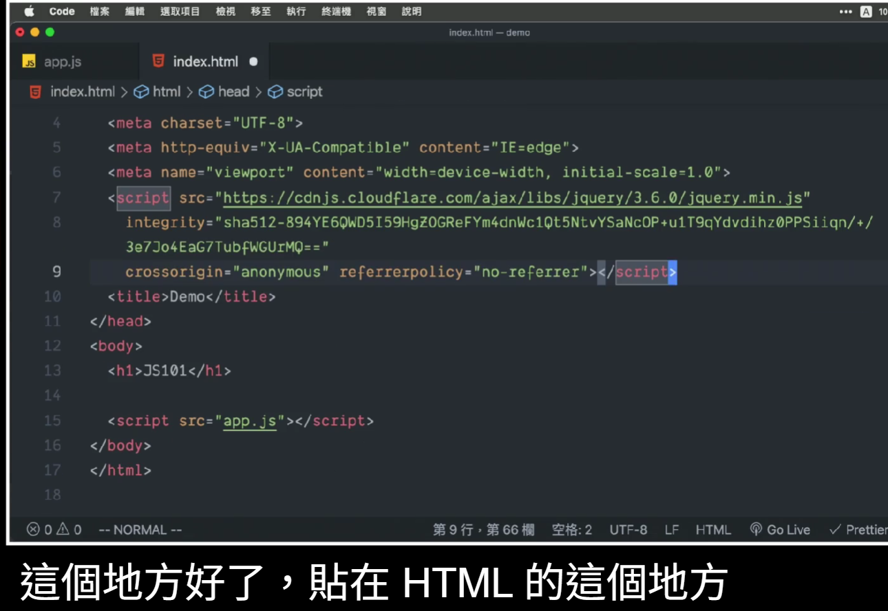

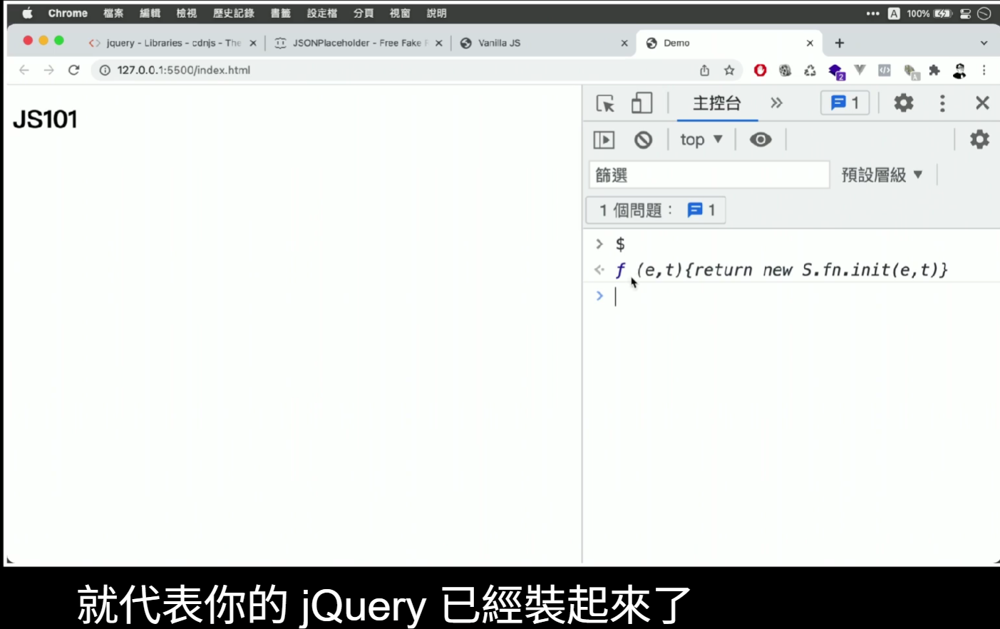

### jQuery 的基本用法

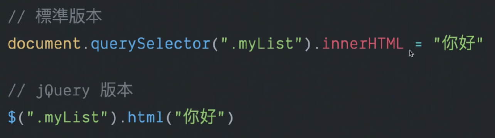

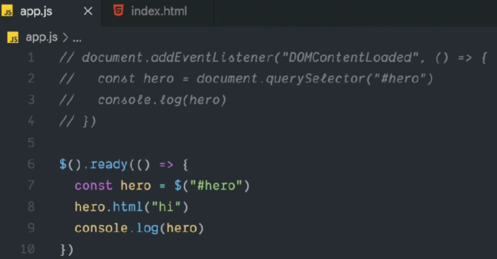

### jQuery.ajax()：

先去 placeholder 找一個假API來練習

placeholder 網址：https://jsonplaceholder.typicode.com/

找 post 這個假 API：https://jsonplaceholder.typicode.com/posts

再去 jQuery 搜 ajax：

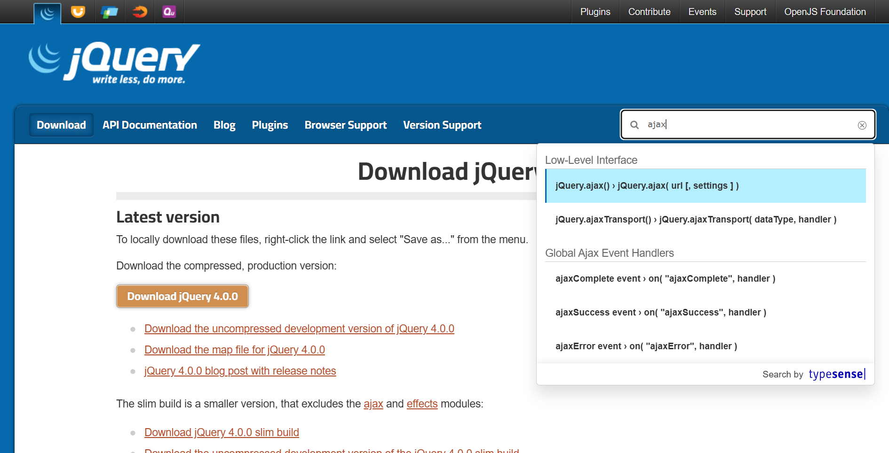

```js
// 語法
$.ajax({
  url: "test.html",
  context: document.body,
}).done(function () {
  $(this).addClass("done");
});
```

```js
// 示範
const url = "https://jsonplaceholder.typicode.com/posts";
$.ajax({ url }).done((posts) => {
  posts.forEach((post) => {
    console.log(post.title);
  });
});
```

返回[JavaScript 技術筆記](#javascript-技術筆記)

## YouBike練習題

### 一般寫法

HTML 在 JS101-main 資料夾：

https://github.com/5xTraining/JS101/blob/07-BMI%E8%A8%88%E7%AE%97%E6%A9%9F/07-BMI%E8%A8%88%E7%AE%97%E6%A9%9F/app.js

找到YouBike2.0即時資訊的 API 介接網址(JSON資料)：
https://tcgbusfs.blob.core.windows.net/dotapp/youbike/v2/youbike_immediate.json

```js
document.addEventListener("DOMContentLoaded", () => {
  const api =
    "https://tcgbusfs.blob.core.windows.net/dotapp/youbike/v2/youbike_immediate.json";

  const keyword = document.querySelector("#searchKeyword");
  const form = document.querySelector("#searchForm");

  form.addEventListener("submit", (e) => {
    e.preventDefault();

    const query = keyword.value.trim();

    if (query != "") {
      fetch(api)
        .then((response) => {
          return response.json();
        })
        .then((sites) => {
          const siteList = document.querySelector(".siteList");
          siteList.innerHTML = "";

          sites
            .filter((site) => {
              return site.ar.includes(query);
            })
            .forEach((site) => {
              const item = `<li class="list-group-item fs-5">
              <i class="fas fa-bicycle"></i>
              ${site.sna.replace("YouBike2.0_", "")} (${site.sbi})<br>
              <small class="text-muted">
              ${site.ar}</small>
              </li>`;

              siteList.insertAdjacentHTML("beforeend", item);
            });
        });
    }
  });
});
```

最終效果：

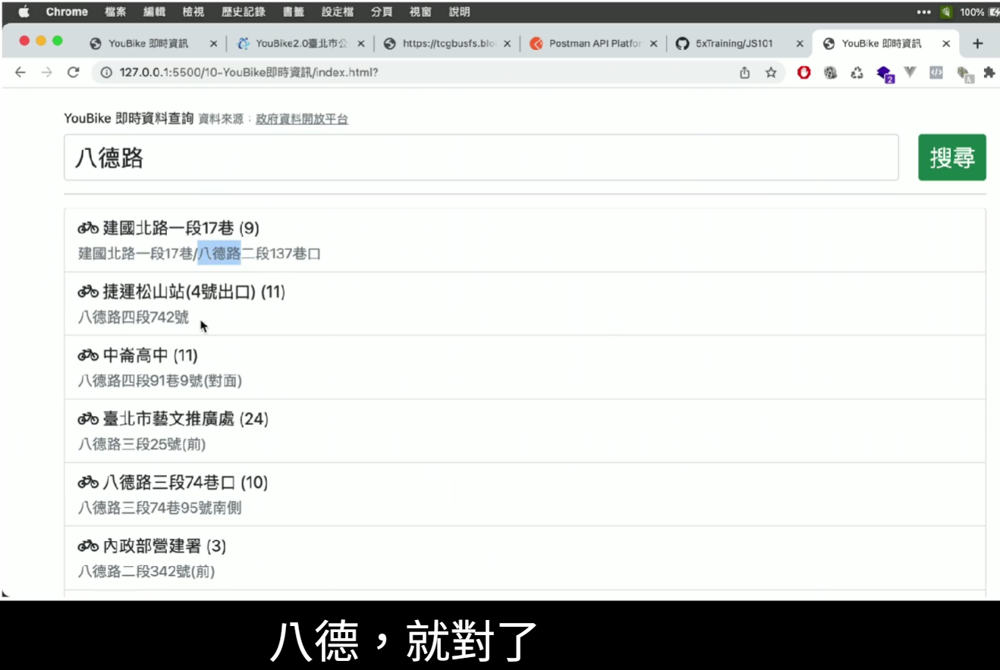

### 用 jQuery 寫法改寫

首先要引入 jQuery 的 CDNJS [教學在上面](#安裝-jquery)

找到YouBike2.0即時資訊的 API 介接網址(JSON資料)：
https://tcgbusfs.blob.core.windows.net/dotapp/youbike/v2/youbike_immediate.json

#### Postman

可利用 Postman 解析這個 API：

在 GET 後方輸入框貼上 API 網址再送出就可以得到整理過的資料了

Postman 會幫忙自動排版以及抓取當下最新更新的資料

#### Font Awesome

可引入 Font Awesome 使用各種 icon

1. 開啟 cdnjs 官方網站。https://cdnjs.com/

2. 在網頁上方的搜尋框輸入：font-awesome。

3. 點選進入 font-awesome 的專屬頁面。https://cdnjs.com/libraries/font-awesome

4. 選擇版本：在頁面頂端的版本下拉選單中切換至 6.7.2。

5. 找到列在第一個或名為 css/all.min.css 的檔案。點擊<> 圖示自動複製程式碼。

6. 貼過去HTML的head裡。

```js
// jQuery 版本

// 用 ready 代替 ...DOMContentLoaded...
$().ready(() => {
  const api =
    "https://tcgbusfs.blob.core.windows.net/dotapp/youbike/v2/youbike_immediate.json";

  // 用 $() 代替 ...document.querySelector...
  const keyword = $("#searchKeyword");
  const form = $("#searchForm");

  // 用 form.submit() 代替 form.addEventListener...
  form.submit((e) => {
    e.preventDefault();

    // 因為上面用 $() 代替 ...document.querySelector...，代表這個已經不是透過querySelector抓回來的元素，它現在是jQuery的東西，不能再用.value.trim()，要改用.val()，而且不必寫.trim()。
    const query = keyword.val();
    // 用 ajax 寫法代替 fetch 寫法
    if (query != "") {
      $.ajax({ url: api }).done((sites) => {
        // 用 $() 代替 document.querySelector()
        const siteList = document.querySelector(".siteList");
        // 用 html("") 代替 innerHTML = ""
        siteList.html("");

        sites
          .filter((site) => {
            return site.ar.includes(query);
          })
          .forEach((site) => {
            const item = `<li class="list-group-item fs-5">
            <i class="fas fa-bicycle"></i>
            ${site.sna.replace("YouBike2.0_", "")} (${site.sbi})<br>
            <small class="text-muted">
            ${site.ar}</small>
            </li>`;
            // 用 append 代替 insertAdjacentHTML("beforeend", item);
            siteList.append(item);
          });
      });
    }
  });
});
```

### 課堂實作練習fetch和await(非 jQuery)

```js
// YouBike練習一 fetch & then & catch

const url =
  "https://tcgbusfs.blob.core.windows.net/dotapp/youbike/v2/youbike_immediate.json";
const result = fetch(url);

result
  .then((resp) => {
    //response物件{...}
    return resp.json(); //用json格式解讀資料
  })
  .then((stations) => {
    stations
      //第一種練習的第一種寫法
      .filter((station) => {
        return station.ar.includes("中山北路");
      })
      .filter((station) => {
        return station.available_rent_bikes > 10;
      })
      //第一種練習的第二種寫法
      .filter((station) => {
        return (
          station.ar.includes("中山北路") && station.available_rent_bikes > 10
        );
      })
      //第一種練習的第三種寫法在下面練習二的try裡的第4到第10行
      .forEach((station) => {
        console.log(station.sna);
      });
  })
  .catch((err) => {
    console.log(err);
  });
```

```js
// YouBike練習二 try & catch (搭配 async/await)

const url =
  "https://tcgbusfs.blob.core.windows.net/dotapp/youbike/v2/youbike_immediate.json";
try {
  const resp = await fetch(url);
  const stations = await resp.json();
  stations
    .filter((station) => station.ar.includes("中山北路"))
    .filter((station) => station.available_rent_bikes > 10)
    .forEach((station) => {
      console.log(station.sna);
    });
} catch (err) {
  console.log(err);
}
```

返回[JavaScript 技術筆記](#javascript-技術筆記)

## module / export & import

如果同個HTML需要引入多個JS但順序很複雜怎麼辦?

同時想引入lib.js和app.js
HTML只需要引入app.js

```html
index.html裡：

<script src="app.js" type="module"></script>
```

```js
lib.js裡：

function hi() {
  console.log(hi);
}
function hey() {
  console.log(hey);
}
// named export 具名匯出
export { hi, hey };
----------------------------------
// export default 預設匯出
export default hey;
————————————————————————————————————————————
app.js裡：

// import 引入 lib.js
import { hi, hey } from "./libs";

如果老闆在這裡寫了
function hi() {
  console.log("here");
}
跟我在lib.js的hi重名了怎麼辦?
{}裡面的東西可以用as取一個別名，避免和下面取一樣的名字的東西重複。
引入hi同時給它一個綽號hh。
import { hi as hh, hey } from "./lib.js";

console.log(hi);
console.log(hh); 就不會重複兩個hi了
----------------------------------
// 下方這種沒有{}的會找default預設好的來引入(也就是896行的hey)
// cc可以改別的名字，不管寫cc還是什麼，都會引入預設好的hey
import cc from "./lib.js";
```

返回[JavaScript 技術筆記](#javascript-技術筆記)

## npm / package.json

建立package.json


寫腳本測試 "scripts":{}


安裝 dayjs ： npm i dayjs


安裝後的變化


安裝 vue ： npm i vue


卸載的方式 npm uninstall vue


加上"type"="module",


測試node跑成功了沒


承上頁


安裝打包工具 vite ： npm i -D vite


npm run dev


返回[JavaScript 技術筆記](#javascript-技術筆記)

## axios

```html
index.html裡：
<script src="app.js" type="module"></script>
```

```js
// npm install axios
axios是用來幫助程式與伺服器交換資料（API 串接）的工具
然後npm i -D vite //直接輸入npm i -D vite它會幫我生package.json
並寫腳本"scripts": {"dev": "vite"}
然後npm run dev
打開5173連結

題：youbike 復興南路上，可借車數 >= 5 的站名
用axios就可以省略.json的步驟

import axios from "axios";
console.log(axios);

const url =
  "https://tcgbusfs.blob.core.windows.net/dotapp/youbike/v2/youbike_immediate.json";
const result = fetch(url);

GET/POST

.then寫法

axios.get(url).then((resp) => {
  const stations = resp.data;

  stations
    .filter((st) =>
      st.ar.includes("復興南路") && station.available_rent_bikes >= 5)
    .forEach((st) =>
      console.log(station.sna));
    });

await寫法

try {
    const response = await axios.get(url)
    const stations = response.data
    stations
        .filter(st => st.ar.includes("復興南路"))
        .filter(st => st.available_rent_bikes >= 5)
        .forEach(st => {
            console.log(st.sna)
        });

} catch (err) {
    console.log(err)
}
```

返回[JavaScript 技術筆記](#javascript-技術筆記)

## dayjs

```html
index.html裡：

<script src="app.js" type="module"></script>
...
<body>
  <button id="prevMonth">-</button>
  <input type="text" id="currentMonth" />
  <button id="nextMonth">+</button>
</body>
```

```js
// npm i dayjs
題：製作月份計算器

import dayjs from "dayjs";
let thisMonth = dayjs(); // 現在

const prevMonth = document.querySelector("#prevMonth");
const nextMonth = document.querySelector("#nextMonth");
const currentMonth = document.querySelector("#currentMonth");

prevMonth.addEventListener("click", () => {
  thisMonth = thisMonth.subtract(1, "month");
  setMonthValue();
});
nextMonth.addEventListener("click", () => {
  thisMonth = thisMonth.add(1, "month");
  setMonthValue();
});

setMonthValue();
// 程式碼從上到下執行時，需先呼叫一次 setMonthValue()，網頁剛打開時 #currentMonth 的欄位會才不會是空的。

function setMonthValue() {
  currentMonth.value = thisMonth.format("YYYY/M");
}
```

返回[JavaScript 技術筆記](#javascript-技術筆記)

## Block Scope / function scope / lexical scope / closure / IIFE

```js
// scope（作用域）= 去哪裡找東西

Block Scope（區塊作用域）：let 與 const 的地牢

{}關得住let和const，關不住var。
常見的Block Scope有if判斷式和for迴圈。

示範：
if (true) {
    let blockLet = "我在裡面";
}
// 牆外的人
console.log(blockLet); // ❌ 噴錯：找不到 blockLet
----------------------------------
function scope（函式作用域）：var 的地牢

var 會穿透 if 或 for 的括號，直到遇到 function 才停下來；而 let/const 只要遇到 {} 就會被關住。

示範：
function myRoom() {
    if (true) {
        var ghost = "我在這！"; // 雖然在 if 裡面
    }
    console.log(ghost); // ✅ 抓得到！因為 var 穿透了 if 的牆
}
----------------------------------
var let const 都可以從內部看見外部。
如果內部找不到某個變數，它會往上一層的環境去搜尋，直到最外層（Window 或 Global）。
----------------------------------
lexical scope：（詞法作用域）
找變數時會去它被定義的地方找，而不是去執行的地方。
————————————————————————————————————————————
//closure 閉包
外面的變數被打包帶走，這個變數就叫 scope free variable 自由變數。

for (var i = 0; i<3; i++) {
setTimeout(() => {
console.log(i)
}, 1000)
}
印出3個3
----------------------------------
for (let i = 0; i<3; i++) {
setTimeout(() => {
console.log(i)
}, 1000)
}
印出 0 1 2
----------------------------------
//必須用 var 但又要印出 0 1 2
// IIFE用法
for (var i = 0; i < 3; i++) {
  (function (n) {
    setTimeout(() => {
      console.log(n);
    }, 1000);
  })(i);
}
————————————————————————————————————————————
//匿名函式
// IIFE = Immediately Invoked Function Expression是JS中一種在定義後立即執行的函式

第一種
(function () {
  console.log(123);
})();

第二種
(function (x) {
  console.log(x);
})(123);
```

返回[JavaScript 技術筆記](#javascript-技術筆記)

## `__proto__` / prototype / 原型打造 / 語法糖衣

```js
//物件導向程式設計 OOP
1.所有JS物件都有 __proto__ 屬性，空值例外 null.__proto__
2.所有JS函式都有 prototype 屬性，預設值是空物件{}
————————————————————————————————————————————
// 工廠函式 缺點：耗記憶體
function heroCreator(name, age) {
  const hero = {
    name: name,
    age: age,
    attack: function () {
      console.log("ATTACK!");
    },
    sleep: function () {
      console.log("Zzzzz!");
    },
  };

  return hero;
}

const h1 = heroCreator("nancy", 18);
const h2 = heroCreator("kitty", 20);
----------------------------------
// 原型繼承(原型打造) 優點：省記憶體
const actions = {
  attack: function () {
    console.log("ATTACK!");
  },
  sleep: function () {
    console.log("ZZZZ");
  },
};

function heroCreator(name, age) {
  // 以 ... 為原型打造物件
  const h = Object.create(actions);

  Object.create(actions)直接建立兩個物件之間的父子關係，把 actions物件掛到 h 的 __proto__ 上，或者說把 h 的 __proto__ 指向生他的actions物件。

  h.name = name;
  h.age = age;

  return h;
}
// h1 和 h2 透過 __proto__ 指向同一個 actions 物件
const h1 = heroCreator("nancy", 18);
const h2 = heroCreator("kitty", 20);
————————————————————————————————————————————
const o = {hello:123, world:456}
o.hello  <-- 123
o.hi     <-- undefined
o.__proto__  <-- 物件 找不到我要的它就往下一個找
o.__proto__.__proto__  <-- null => undefined
----------------------------------
function heroCreator2( 傳進來的參數 ) {
  this.存進去的名稱 = 傳進來的參數;
}

function heroCreator2(name, age) {

  1. this ---> { } 把this指向某個空物件
  把 this 的 __proto__ 指向生這個物件的函式的prototype，prototype預設值是空物件。

  this.name = name; //可以寫成 this.a = name
  this.age = age; //可以寫成 this.b = age

  2. return this
  下面有new，函數執行完後，它會自動回傳 this 物件，所以不用return
  如果沒有new就是一般函式要有return，如果也沒有return，就會undefined
  建構函式的回傳覆蓋：如果同時寫了return和下面的new，return後面若帶數字或字串(原始型別)就會被忽略，但如果帶物件型別(一般物件 {}、陣列 []、函式 function)就不會忽略return，會回傳return的東西。
}
heroCreator2.prototype = actions;

const h1 = new heroCreator2("nancy", 18);
----------------------------------
// class 類別 例如：String, Array
// instance 實體 例如：h1, h2...
// instance = new class()
const s = "hello";
String.prototype.hi = 123;
s.hi;
Array.prototype.myMap = function () {
  console.log("my map");
};
----------------------------------
// constructor建構函式

// 這個class是 prototype chain 的語法糖衣
class heroCreator3 {
  constructor(name, age) {
    this.name = name;
    this.age = age;
  }

  sayMyName() {
    console.log(`hi, ${this.name}`);
    // `hi, ${...}`在字串中直接嵌入變數或表達式，不需要用一堆 + 號來連接。
  }

  attack() {
    console.log("ATTACK!");
  }

  sleep() {
    console.log("ZZZZ");
  }
}

const h1 = new heroCreator3("nancy", 18);
```

```js
// 複習 Scope（作用域）
var a = 1;

function hi() {
  a = 2;
  console.log(a); //印出2
  var a = 3;
}

hi();
console.log(a); // 印出1

在函式裡面a = 2這行的意思是想把a改成2，找到var a = 3有a，所以不用去函式外面找var a = 1。
所以a = 2下面那行印出2。
最後的console.log(a)在函式外，所以去找最上面的var a = 1。
----------------------------------
var a = 1;

function hi() {
  a = 2;
  console.log(a); //印出2
}

hi();
console.log(a); // 印出2

函式裡沒有a，往外找到var a = 1，所以a = 2下面那行印出2
外面的var a = 1被改成2了，所以最後印出2。
————————————————————————————————————————————
```

返回[JavaScript 技術筆記](#javascript-技術筆記)

## this

this 代名詞 決定了誰正在執行這段程式碼

1. 誰呼叫，誰就是 this，跟它怎麼被定義無關，只跟呼叫方式有關。
2. 是否有使用 new
3. 是否有使用箭頭函式() => {} // 2和3不能同時使用
4. 是否有使用 call / apply / bind
5. 是否有使用「嚴格模式」

```js
const hero = {
  name: "cc",
  age: 18,
  attack: function () {
    console.log(this);
  },
};

hero.attack();

// hero就是呼叫者this
```

```js
function hi() {
  function hey() {
    console.log(this);
  }

  hey();
}

hi();

這邊的this指向全域物件，因為它前面沒有東西，不像上方那組的hero。
```

```js
function hi() {
  console.log(this);
}

new hi();

物件導向，使用 new 關鍵字時，this 會指向剛被創造出來的空物件。
```

```js
const hi = (a, b, c) => {
  console.log(arguments);
};

hi(1, 2, 3);

箭頭函式沒有arguments，找不到arguments就會往外找，找不到就會壞掉。
箭頭函式也沒有this，找不到this就會往外找，通常外面會有一個this指向window全域，所以最後會指向全域變數。
```

```js
arguments：沒有「...收展功能」前都用這個拿參數
function hi(a, b, c) {
  console.log(arguments);
}

hi(1, 2, 3);
```

```js
// 使用 .call() 和 .apply() 來強行奪取 this 的控制權
const hero = {
  name: "cc",
  age: 18,
  attack: function () {
    console.log(this);
  },
};

const arr = [1, 2, 3];

hero.attack.call(arr, "aa", "bb");

// 意思是：我要執行 hero 裡的 attack 函式，但請把內部的 this 硬改成 arr。

hero.attack.apply(arr, ["aa", "bb"]);

// 功能同上，call和apply擇一使用，唯一不同的地方是帶參數的方式不一樣。
如果我要帶入的東西是陣列，推薦用apply。
```

```js
// 使用 .bind() 產生一個「硬綁定」的新函式。「硬」指不可被覆蓋。

const hero = {
  name: "cc",
  age: 18,
  attack: function () {
    console.log(this);
  },
};

const arr = ["x", "y", "z"];

const aa = hero.attack.bind(arr);
aa();

雖然aa()前面沒有東西，但透過bind已經把陣列綁定在this了，所以執行aa()的結果是陣列。
如果只打aa，沒有執行，印出來會是一個 function。
```

```js
// 嚴格模式
結果 undefined

function hi() {
  "use strict";
  console.log(this);
}

hi();

當我呼叫 hi()（前面沒有點，也沒有 new）JS會自動把 全域物件 (window) 指派給它(非嚴格模式)。
然後嚴格模式 ("use strict")的JS會認為既然我沒有指定是誰呼叫的，那 this 應該要是空的。
```

```js
// 練習題：不用 var that = this 來解題
var person = {
  name: "cc",
  sayHi: function () {
    console.log("我是" + this.name); // this 是 person

    var that = this; // 過時的方法

    setTimeout(function () {
因為setTimeout裡面的匿名函式是由系統全域（window）呼叫的，為了讓內層函式能存取到外層的 person 物件，開發者會宣告一個變數（that）來捕捉當時正確的 this，然後that 只是一個普通的變數，它會被內層函式透過「閉包機制」保留下來。
      console.log("我是" + that.name);
    }, 0);
  },
};

person.sayHi();
//----------------------------------
// 答案：用IIFE(立即執行函式運算式)
var person = {
  name: "cc",
  sayHi: function () {
    console.log("我是" + this.name);

    setTimeout(
      function () {
        console.log("我是" + this.name);
      }.bind(this),
      0,
    );
  },
};

person.sayHi();
```

返回[JavaScript 技術筆記](#javascript-技術筆記)

> 以上是JavaScript資料夾 : 0504.js

> 以下是0504資料夾 : app.js

## 初階 TODO 列表製作

```html
index.html裡：

...
    <title>0504下午~0505上午</title>
    <script defer src="app.js" type="module"></script>
    <link rel="stylesheet" href="reset.css" />
    <link rel="stylesheet" href="app.css" />
  </head>
  <body>
    <form id="taskform">
      <p>TODO</p>
      <input type="text" name="text" id="taskInput" />
      <button id="addBtn">新增</button>
    </form>
    <hr />
    <div>
      <ul id="taskList">
        <li class="task">
          <span>HELLO</span>
          <button type="button">X</button>
        </li>
      </ul>
    </div>
  </body>
</html>
```

```js
app.js裡：

// type = module
// - defer
// - use strict
//--------------------------------------
const addBtn = document.querySelector("#addBtn");
const taskInput = document.querySelector("#taskInput");
const taskList = document.querySelector("#taskList");
const taskform = document.querySelector("#taskform");
//--------------------------------------
// 當發生「新增」動作時，指揮「畫圖」與「存檔」同時運作。
function addtask(text) {
  renderTask(text);
  saveTask(text);
}
//--------------------------------------
// 視覺呈現 接收一個 text。製作出 <li> 標籤字串。用 insertAdjacentHTML 塞進畫面的最上方 (afterbegin)。順便清空輸入框，方便下次輸入。
function renderTask(text, id) {
  const item = `
    <li class="task">
      <span>${text}</span>
      <button data-id="${id}">X</button>
    </li>`;

  taskList.insertAdjacentHTML("afterbegin", item);
  taskInput.value = "";
}
//--------------------------------------
// 把新的任務存進 localStorage
function saveTask(text) {
  const tasks = loadTask();

  const taskObj = {
    id: crypto.randomUUID(),
    task: text,
  };

  tasks.push(taskObj);
  updateStorage(tasks);
}
//--------------------------------------
function updateStorage(tasks) {
  localStorage.setItem("tasks", JSON.stringify(tasks));
}
//--------------------------------------
// 從localStorage抓資料出來
function loadTask() {
  let tasks = localStorage.getItem("tasks");
  if (tasks == null) {
    tasks = [];
  } else {
    tasks = JSON.parse(tasks);
  }

  return tasks;
}
//--------------------------------------
function init() {
  const tasks = loadTask();

  tasks.forEach((t) => {
    const { id, task } = t;
    renderTask(task, id);
    // const { id, task } = t;其實是const id = t.id;和const task = t.task;
  });

  taskform.addEventListener("submit", (e) => {
    e.preventDefault();
    const text = taskInput.value.trim(); // 取得輸入框內容
    if (text !== "") {
      addtask(text); // 呼叫新增任務的函式
    }
  });

  taskList.addEventListener("click", (e) => {
    // const target = e.target 解構變成下面那行，這行的意思是「如果我點到的東西是按鈕...」。
    const { target } = e;
    if (target.nodeName == "BUTTON") {
      const id = target.dataset.id;
      const idx = tasks.findIndex((t) => {
        return t.id == id;
        // 從清單中找出哪一個任務的 ID 跟目前點擊到的按鈕 ID 一樣。
      });

      // 在上面fn renderTask的button塞data-id="${id}"

      tasks.splice(idx, 1);
      updateStorage(tasks);

      target.parentNode.remove();
    }
  });
}

init();
```

返回[JavaScript 技術筆記](#javascript-技術筆記)

## 製作 TODO APP

使用老師提供的 todoo-app-main 資料夾

```html
...
    <title>TODO App</title>
    <link rel="stylesheet" href="src/styles/style.css" />
    <script src="src/scripts/app.js" type="module"></script>
  </head>

  <body x-data="appData" class="container px-2 py-4 mx-auto">
    <header class="banner">
      <h1><a href="#todo" class="taskLink">TODO!</a></h1>
      <div class="subtitle">
        <p class="text">Simple and Stupid TODO App</p>
        <p class="hidden text sm:block">
          powered by
          <a href="https://5xcampus.com" class="text-link" target="_blank">5xCampus</a>
          |
          <a href="https://todoo.5xcamp.us" class="text-link" target="_blank">API</a>
          |
          <a href="https://github.com/5xTraining/todoo-app" class="text-link" target="_blank">GitHub</a>
        </p>
      </div>
    </header>

    <main class="px-6 todo-app main">
      <header>
        <nav class="navbar">
          <a x-show="!isLogin" class="loginLink" @click.prevent="goLogin" href="#login">登入</a>
          <a x-show="!isLogin" class="signUpLink" @click.prevent="goSignUp" href="#sign_up">註冊</a>
          <a x-show="isLogin" @click="logout" class="signUpLink" href="#">登出</a>
        </nav>
      </header>

      <section id="userSection">
        <!-- Login Section start -->
        <section x-show="section == 'login'" id="loginSection">
          <h1>登入</h1>
          <form @submit.prevent="login" id="loginForm">
            <div class="field">
              <label>
                <h3>Email</h3>
                <input x-model="email" type="email" id="loginEmail" autocomplete="email" spellcheck="false" placeholder="Email 信箱" />
              </label>
            </div>

            <div class="field">
              <label>
                <h3>密碼</h3>
                <input
                  x-model="password"
                  type="password"
                  id="loginPassword"
                  autocomplete="current-password"
                  spellcheck="false"
                  placeholder="密碼，至少需要 6 個字"
                />
              </label>
            </div>

            <div class="items-center justify-between block sm:flex field">
              <button>登入</button>
              <div class="text-xl text-gray-600">
                還沒有帳號嗎？<a href="#" @click.prevent="goSignUp" class="text-link signUpLink">註冊</a>一個吧！
              </div>
            </div>
          </form>
        </section>
        <!-- Login Section end -->

        <!-- Sign Up Section start -->
        <section x-show="section == 'signup'" id="signUpSection">
          <h1>註冊帳號</h1>
          <form @submit.prevent="register" id="signUpForm">
            <div class="field">
              <label>
                <h3>Email</h3>
                <input x-model="email" type="email" id="signUpEmail" autocomplete="email" spellcheck="false" placeholder="Email 信箱" />
              </label>
            </div>

            <div class="field">
              <label>
                <h3>暱稱</h3>
                <input
                  x-model="nickname"
                  type="text"
                  id="signUpNickname"
                  autocomplete="name"
                  spellcheck="false"
                  placeholder="要怎麼稱呼你呢？"
                />
              </label>
            </div>

            <div class="field">
              <label>
                <h3>密碼</h3>
                <input
                  x-model="password"
                  type="password"
                  id="signUpPassword"
                  autocomplete="new-password"
                  spellcheck="false"
                  placeholder="密碼，至少需要 6 個字"
                />
              </label>
            </div>

            <div class="items-center justify-between block sm:flex field">
              <button>註冊</button>
              <div class="text-xl text-gray-600">
                已經有帳號了？<a href="#" @click.prevent="goLogin" class="text-link loginLink">登入</a>
              </div>
            </div>
          </form>
        </section>
        <!-- Sign Up Section end -->
      </section>

      <!-- TODO Section start -->
      <section x-show="section == 'task'" id="taskSection">
        <form @submit.prevent="addTodo" id="todoForm">
          <input x-model="content" type="text" id="taskInput" autocomplete="off" spellcheck="false" placeholder="做點重要的事吧..." />
          <button id="addTodoBtn">新增</button>
        </form>
      </section>
      <!-- TODO Section end -->
    </main>

    <section class="todo-list">
      <ul class="items">
        <!-- item start -->
        <!-- 被template包起來的東西不會顯示 -->
        <template x-for="todo in todos">
          <li>
            <div class="item-content">
              <label>
                <input type="checkbox" />
                <p class="content" x-text="todo.content"></p>
              </label>
            </div>
            <div class="item-control">
              <a href="#" class="edit"></a>
              <!-- 如果js用deleteTodo(id)，不用寫data-id="123"，然後@click.prevent="deleteTodo"要變成@click.prevent="deleteTodo(todo.id)" -->
              <!-- 如果JS不是用deleteTodo(id)，那下面這行就要改成<a data-id="123" @click.prevent="deleteTodo" href="#" class="delete"
                > -->
              <a @click.prevent="deleteTodo(todo.id)" href="#" class="delete"></a>
            </div>
          </li>
        </template>
        <!-- item end -->
      </ul>
    </section>

    <footer>
      <p>
        powered by
        <a href="https://5xcampus.com" class="underline">5XCAMPUS</a> | <a href="https://todoo.5xcamp.us" class="underline">API</a> |
        <a href="https://github.com/5xTraining/todoo-app" class="underline">SOURCE</a>
      </p>
    </footer>
  </body>
</html>
```

```js
pages.js裡：

import axios from "axios"
const taskSection = document.querySelector("#taskSection")
const loginSection = document.querySelector("#loginSection")
const signUpSection = document.querySelector("#signUpSection")
const loginLinks = document.querySelectorAll(".loginLink")
const signUpLinks = document.querySelectorAll(".signUpLink")
const taskLinks = document.querySelectorAll(".taskLink")
// ————————————————————————————————————
// 註冊
const signUpEmail = document.querySelector("#signUpEmail")
const signUpNickname = document.querySelector("#signUpNickname")
const signUpPassword = document.querySelector("#signUpPassword")
const signUpForm = document.querySelector("#signUpForm")
signUpForm.addEventListener("submit", (e) => {
  e.preventDefault()
  // 打 API
  const url = "https://todoo.5xcamp.us/users"
  const userData = {
    user: {
      email: signUpEmail.value,
      nickname: signUpNickname.value,
      password: signUpPassword.value,
    },
  }
  axios
    .post(url, userData)
    .then((resp) => {
      console.log(resp)
      showLoginPage()
    })
    .catch((err) => {
      console.log(err.response.data)
    })
  // URL userdata axios.post(地方,傳啥).then.catch
  console.log(axios)
  console.log("Email:", signUpEmail.value)
  console.log("暱稱:", signUpNickname.value)
  console.log("密碼:", signUpPassword.value)
})
// ————————————————————————————————————
// 登入
const loginEmail = document.querySelector("#loginEmail")
const loginPassword = document.querySelector("#loginPassword")
const loginForm = document.querySelector("#loginForm")
loginForm.addEventListener("submit", (e) => {
  e.preventDefault()
  // 打 API
  const url = "https://todoo.5xcamp.us/users/sign_in"
  const userData = {
    user: {
      email: loginEmail.value,
      password: loginPassword.value,
    },
  }
  axios
    .post(url, userData)
    .then((resp) => {
      const token = resp.headers.authorization
      if (token) {
        localStorage.setItem("userToken", token)
        showTaskPage()
      }
    })
    .catch((err) => {
      console.log(err.response.data)
    })

  console.log("Email:", loginEmail.value)
  console.log("密碼:", loginPassword.value)
})
// ————————————————————————————————————
// TODO
const todoForm = document.querySelector("#todoForm")
const taskInput = document.querySelector("#taskInput")

todoForm.addEventListener("submit", (e) => {
  e.preventDefault()
  const content = taskInput.value
  const token = localStorage.getItem("userToken")
  if (token != "" && content != "") {
    const url = "https://todoo.5xcamp.us/todos"
    const todoData = {
      todo: {
        content,
      },
    }

    axios
      .post(url, todoData, { headers: { Authorization: token } })
      .then((resp) => {
        console.log(resp)
      })
      .catch((err) => {
        console.log(err.response.data)
      })
  }
})
// ————————————————————————————————————
taskLinks.forEach((link) => {
  link.addEventListener("click", (e) => {
    e.preventDefault()
    showTaskPage()
  })
})

loginLinks.forEach((link) => {
  link.addEventListener("click", (e) => {
    e.preventDefault()
    showLoginPage()
  })
})

signUpLinks.forEach((link) => {
  link.addEventListener("click", (e) => {
    e.preventDefault()
    showSignUpPage()
  })
})

const initPages = () => {
  const token = localStorage.getItem("userToken")
  if (token) {
    showTaskPage
  } else {
    showLoginPage()
  }
}

const showTaskPage = () => {
  taskSection.classList.remove("hidden")
  loginSection.classList.add("hidden")
  signUpSection.classList.add("hidden")

  const url = "https://todoo.5xcamp.us/todos"
  const token = localStorage.getItem("userToken")
  if (token) {
    // if(token)就是假如有登入成功。
    axios
      .get(url, { headers: { Authorization: token } })
      .then((resp) => {
        console.log(resp)
      })
      .catch((err) => {
        console.log(err)
      })
  }
}

const showLoginPage = () => {
  taskSection.classList.add("hidden")
  loginSection.classList.remove("hidden")
  signUpSection.classList.add("hidden")
}

const showSignUpPage = () => {
  taskSection.classList.add("hidden")
  loginSection.classList.add("hidden")
  signUpSection.classList.remove("hidden")
}

export { initPages, showTaskPage, showLoginPage, showSignUpPage }
```

```js
app.js裡：

//安裝 npm install alpinejs

// 執行Alpine要先初始化，寫這三行：

// import Alpine from "alpinejs"

// window.Alpine = Alpine

// Alpine.start()

// 信箱mo@g
// 密碼mmm111
//-------------------------------
// 有async在函數裡面才可以用await
// 沒有函數就可以直接在開頭寫await...
//-------------------------------
import Alpine from "alpinejs"
import axios from "axios"

window.Alpine = Alpine

// data
const appData = () => ({
  section: "login",
  isLogin: false,
  email: "",
  password: "",
  nickname: "",
  content: "",
  todos: [], // todos: [1, 2, 3],裡面寫多少數字決定要列出多少「我要學Python」任務，搭配HTML的template x-for="todo in todos"包住「我要學Python」的li。

  init() {
    const token = this.getToken()
    if (token) {
      this.isLogin = true
      this.goTask()
      this.getTodos()
    } else {
      this.isLogin = false
      this.goLogin()
    }
  },
  getToken() {
    return localStorage.getItem("userToken")
  },

  resetForm() {
    this.email = ""
    this.password = ""
    this.nickname = ""
  },

  // TODO列表
  // 從伺服器把所有待辦事項抓回來
  async getTodos() {
    const url = "https://todoo.5xcamp.us/todos"
    const token = this.getToken() // 伺服器必須知道是「誰」要看清單，所以去 localStorage 把登入時存的身分證（Token）拿出來。

    try {
      const resp = await axios.get(url, { headers: { Authorization: token } })

      this.todos = resp.data.todos
    } catch (err) {
      console.log(err)
    }
  },

  // 刪除TODO
  // async deleteTodo(e) {
  //   // 按到誰?
  //   console.log(e.currentTarget.dataset.id)

  //   const id = e.currentTarget.dataset.id
  //   const url = `https://todoo.5xcamp.us/todos/${id}`
  //   const token = this.getToken()
  //   try {
  //     await axios.delete(url, { headers: { Authorization: token } })
  //     this.getTodos()
  //   } catch (err) {
  //     console.log(err)
  //   }
  // },

  // 刪除TODO更推薦的寫法
  async deleteTodo(id) {
    // console.log(id)
    if (id) {
      const url = `https://todoo.5xcamp.us/todos/${id}`
      const token = this.getToken()

      try {
        // 演戲
        const idx = this.todos.findIndex((t) => t.id == id)

        this.todos.splice(idx, 1)

        // 真刪
        await axios.delete(url, { headers: { Authorization: token } })
      } catch (err) {
        console.log(err)
      }
    }
  },

  // 新增TODO
  async addTodo() {
    const url = "https://todoo.5xcamp.us/todos"
    const token = this.getToken()
    const todoData = {
      todo: {
        content: this.content,
      },
    }

    if (token && this.content !== "") {
      try {
        // 演戲(樂觀更新)
        this.todos.unshift({
          id: crypto.randomUUID(),
          content: this.content,
          complete_at: null,
          // 代表該筆代辦事項的完成時間，當值為 null 時，代表這項任務還沒被勾選完成。
        })
        this.content = ""

        // 新增 todo 列表
        const resp = await axios.post(url, todoData, { headers: { Authorization: token } })

        // 更新 todo 列表
        this.getTodos()
      } catch (err) {
        console.log(err)
      }
    }
  },
  // 登出
  async logout() {
    const url = "https://todoo.5xcamp.us/users/sign_out"
    const token = this.getToken()

    if (token) {
      try {
        // 清 session
        const resp = await axios.delete(url, { headers: { Authorization: token } })

        // 清 token 把瀏覽器的憑證刪除
        localStorage.removeItem("userToken")

        this.isLogin = false

        this.goLogin()
      } catch (err) {
        console.log(err)
      }
    }
  },

  //註冊
  async register() {
    const url = "https://todoo.5xcamp.us/users"
    const userData = {
      user: {
        email: this.email,
        password: this.password,
        nickname: this.nickname,
      },
    }

    try {
      const resp = await axios.post(url, userData)
      this.resetForm() // 呼叫 resetForm() 清空輸入框
      this.goLogin()
    } catch (err) {
      console.log(err)
    }
  },

  // 登入
  async login() {
    const url = "https://todoo.5xcamp.us/users/sign_in"
    const userData = {
      user: {
        email: this.email,
        password: this.password,
      },
    }

    try {
      const resp = await axios.post(url, userData)
      const token = resp.headers.authorization
      if (token) {
        localStorage.setItem("userToken", token) // 把 Token 存在瀏覽器裡，重新整理網頁才不會被登出
        this.resetForm()
        this.isLogin = true
        this.goTask()
      }
    } catch (err) {
      console.log("登入失敗")
    }
  },

  // login() {
  //   const url = "https://todoo.5xcamp.us/users/sign_in"
  //   const userData = {
  //     user: {
  //       email: this.email,
  //       password: this.password,
  //     },
  //   }
  //   axios
  //     .post(url, userData)
  //     .then((resp) => {
  //       const token = resp.headers.authorization
  //       if (token) {
  //         localStorage.setItem("userToken", token)
  //         this.goTask()
  //       }
  //     })
  //     .catch((err) => {
  //       console.log(err.response.data)
  //     })
  //   console.log(this.email, this.password)
  // },

  //下面的"login"、"signup"、"task"是自己定義的，用來標記目前網頁應該顯示哪一個畫面，也可以改成別的名字，但也要記得去HTML改。
  goLogin() {
    this.section = "login"
  },
  goSignUp() {
    this.section = "signup"
  },
  goTask() {
    this.section = "task"
  },
})

Alpine.data("appData", appData)
//註冊寫法：Alpine.data("自己取名比如appData", appData)，再去HTML的main後面加入x-data="appData" <---這個appData是JS註冊那邊自己取的。

Alpine.start()
```

返回[JavaScript 技術筆記](#javascript-技術筆記)

## pass by reference / pass by value

```js
// "pass by reference"傳址
let obj = { name: "cc", age: 18 };

function older(o) {
  o.age += 1;
}

older(obj);
console.log(obj.age); //18

如果把function older(o) {
裡面換成o = {name: "cc", age: 20}
}
結果還是18，因為只在函數裡改，沒有修改原本的物件。

// "pass by value"傳值
// let obj = { name: "cc", age: 18 };
let num = 10;

function add(n) {
  n += 1;
}

add(num);
console.log(num); //10
```

## recursive 遞迴

```js
// 費波那契數
// recursive 遞迴

// n = 第 n 項
function fib(n) {
  if (n == 1 || n == 2) {
    return 1;
  }

  return fib(n - 1) + fib(n - 2);
}

// [1, 1, 2, 3, 5, 8, 13, 21, 34, 55]
console.log(fib(5)); // 5
console.log(fib(8)); // 21
```

## throw

```js
function greeting() {
  throw "Hello world!";
}

function sayHi() {
  try {
    const data = greeting();
    console.log("It worked!", data);
  } catch (e) {
    console.log("Oh no an error:", e);
  }
}

sayHi();
// Oh no an error: Hello world!
```

返回[JavaScript 技術筆記](#javascript-技術筆記)

## TDD

### 安裝 Jest

Jest 是由 Meta (Facebook) 開發並維護的一個 JS 測試框架。

npm i -D jest

```js
在 package.json 裡寫上腳本：
{
  "scripts": {
    "test": "node --disable-warning=ExperimentalWarning  --experimental-vm-modules node_modules/jest/bin/jest.js"
  },
  "type": "module",
  "devDependencies": {
    "jest": "^30.4.2"
  }
}
```

npm run test

### Regex (Regular Expression)

Regex 是一串用來定義「搜尋模式」的文字字串。

https://regex101.com/

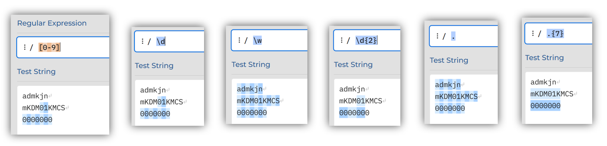

email常規表示法：

https://stackoverflow.com/questions/201323/how-can-i-validate-an-email-address-using-a-regular-expression

```
(?:[a-z0-9!#$%&'*+\x2f=?^_`\x7b-\x7d~\x2d]+(?:\.[a-z0-9!#$%&'*+\x2f=?^_`\x7b-\x7d~\x2d]+)*|"(?:[\x01-\x08\x0b\x0c\x0e-\x1f\x21\x23-\x5b\x5d-\x7f]|\\[\x01-\x09\x0b\x0c\x0e-\x7f])*")@(?:(?:[a-z0-9](?:[a-z0-9\x2d]*[a-z0-9])?\.)+[a-z0-9](?:[a-z0-9\x2d]*[a-z0-9])?|\[(?:(?:(2(5[0-5]|[0-4][0-9])|1[0-9][0-9]|[1-9]?[0-9]))\.){3}(?:(2(5[0-5]|[0-4][0-9])|1[0-9][0-9]|[1-9]?[0-9])|[a-z0-9\x2d]*[a-z0-9]:(?:[\x01-\x08\x0b\x0c\x0e-\x1f\x21-\x5a\x53-\x7f]|\\[\x01-\x09\x0b\x0c\x0e-\x7f])+)\])
```

返回[JavaScript 技術筆記](#javascript-技術筆記)

## TDD 實作

```
建立 __tests__ 資料夾 和 lib 資料夾

__tests__ 裡面放測試檔案

lib 裡面放原始碼檔案

原則：先寫測試再寫原始碼
```

```js
在 __tests__ 的 temperature.test.js 裡：

import { f2c, c2f } from "../lib/temperature.js";

test("1 + 1 = 2", () => {
  expect(1 + 1).toBe(2);
});

test("溫度轉換公式(華氏轉攝氏)", () => {
  expect(f2c(150)).toBe(65.6);
  expect(f2c(178)).toBe(81.1);
});

test("溫度轉換公式(攝氏轉華氏)", () => {
  expect(c2f(38)).toBe(100.4);
  expect(c2f(66)).toBe(150.8);
});
```

```js
在 lib 的 temperature.js 裡：

function f2c(f) {
  return Number((((f - 32) * 5) / 9).toFixed(1));
}
f2c(140);

function c2f(c) {
  return Number(((c * 9) / 5 + 32).toFixed(1));
}
c2f(40);

export { f2c, c2f };
```

```js
在 __tests__ 的 atm.test.js 裡：

存錢功能
可以存錢
不可以存 0 元或是小於 0 元的金額（越存錢越少！）
領錢功能
可以領錢
不能領 0 元或是小於 0 元的金額（越領錢越多！）
不能領超過本身餘額
// 以上是題目

// 存錢功能
import { BankAccount } from "../lib/BankAccount.js";

  // 3A原則
test("可以存錢", () => {
  // Arrange
  const account = new BankAccount(5);

  // Act
  account.deposit(10);

  // Assert
  expect(account.balance()).toBe(15);
});
```

```js
在 lib 的 BankAccount.js 裡：

class BankAccount {
  // Arrange
  constructor(amount) {
    this.balance = amount;
  }

  // Act: 存錢
  deposit(money) {
    if (money > 0) {
      this.balance += money;
    }
  }

  // Assert: 查詢餘額
  getBalance() {
    return this.balance;
  }
}

export { BankAccount };
```

返回[JavaScript 技術筆記](#javascript-技術筆記)

## 進階練習 圖片輪播

```html
index html裡：

...
  <head>
...
    <title>圖片輪播</title>
    <link rel="stylesheet" href="styles/style.css" />
    <script defer src="scripts/app.js"></script>
  </head>
  <body>
    <main>
      <div class="carousel">
        <button class="carousel-btn prev-btn">&larr;</button>
        <div class="container">
          <ul class="slide-track">
            <li class="slide"></li>
            <li class="slide"></li>
            <li class="slide"></li>
            <li class="slide"></li>
            <li class="slide"></li>
          </ul>
        </div>
        <button class="carousel-btn next-btn">&rarr;</button>

        <nav class="navigator">
          <button data-index="0" class="indicator active"></button>
          <button data-index="1" class="indicator"></button>
          <button data-index="2" class="indicator"></button>
          <button data-index="3" class="indicator"></button>
          <button data-index="4" class="indicator"></button>
        </nav>
      </div>
    </main>
  </body>
</html>
```

```css
body {
  margin: 0;
}

/* carousel and container */
.carousel {
  position: relative;
  height: 500px;
  width: 80vw;
  margin: 10px auto;
}

.container {
  height: 100%;
  position: relative;
  overflow: hidden;
}

/* track */
.container > .slide-track {
  margin: 0;
  height: 100%;
  list-style: none;
}

/* slides */
.slide-track > .slide {
  inset: 0;
  width: 100%;
  position: absolute;
}

.slide-track > .slide > img {
  display: block;
  width: 100%;
  height: 100%;
  object-fit: cover;
  object-position: center;
}

/* next and previous navigator buttons */
.carousel .carousel-btn {
  position: absolute;
  background: none;
  border: none;
  font-size: 2em;
  top: 50%;
  transform: translateY(-50%);
  cursor: pointer;
}

.carousel .carousel-btn:hover {
  background-color: rgba(231, 221, 221, 0.2);
}

.carousel .prev-btn {
  left: -60px;
}

.carousel .next-btn {
  right: -60px;
}

/* dot indicators */
.carousel nav {
  padding: 10px;
  display: flex;
  justify-content: center;
}

.carousel nav > .indicator {
  border-radius: 50%;
  border: 0;
  width: 16px;
  height: 16px;
  background-color: rgba(0, 0, 0, 0.4);
  margin: 5px 10px;
  cursor: pointer;
}

.carousel nav > .indicator.active {
  background-color: rgba(0, 0, 0, 0.7);
}

.hide {
  display: none;
}
```

```js
app.js裡：

const carousel = document.querySelector(".carousel")
const slides = carousel.querySelectorAll(".slide")
const track = carousel.querySelector(".slide-track")
const nextBtn = carousel.querySelector(".next-btn")
const prevBtn = carousel.querySelector(".prev-btn")
const navigator = carousel.querySelector(".navigator")
const indicators = navigator.querySelectorAll(".indicator")
let currentIndex = 0

function updateNavigatorButtons(index) {
  if (index == 0) {
    prevBtn.classList.add("hide") //hide寫在css
    nextBtn.classList.remove("hide")
  } else if (index == slides.length - 1) {
    prevBtn.classList.remove("hide")
    nextBtn.classList.add("hide")
  } else {
    prevBtn.classList.remove("hide")
    nextBtn.classList.remove("hide")
  }
}

// 帶入多少index就移動到多少張去
function moveSlide(index) {
  const w = track.clientWidth
  track.style.transform = `translateX(-${index * w}px)`
  updateNavigatorButtons(index)
  updateIndicator(index)
}

function updateIndicator(index) {
  indicators.forEach((indicator) => {
    if (Number(indicator.dataset.index) === index) {
      indicator.classList.add("active")
      // active是class，看css是背景色變黑。
    } else {
      indicator.classList.remove("active")
    }
  })
}

function setupSlides() {
  const w = track.clientWidth

  slides.forEach((slide, i) => {
    slide.style.left = `${i * w}px`
    // 計算每張投影片應該向左偏移多少距離。
  })

  updateNavigatorButtons(currentIndex)
  updateIndicator(currentIndex)
}

setupSlides()

// 監聽器們
prevBtn.addEventListener("click", () => {
  currentIndex--
  moveSlide(currentIndex)
})

nextBtn.addEventListener("click", () => {
  currentIndex++
  // 等於 currentIndex = currentIndex + 1;
  // 最上面有宣告let currentIndex = 0
  // currentIndex代表目前畫面上顯示第幾張投影片
  moveSlide(currentIndex)
})

navigator.addEventListener("click", (e) => {
  if (e.target.matches("button")) {
    const dot = e.target
    const dotIndex = Number(dot.dataset.index)
    console.log(dot.dataset)
    // currentIndex = dot.dataset.index

    moveSlide(currentIndex)
  }
})

// 監聽螢幕寬度變動
window.addEventListener("resize", () => {
  setupSlides() // 1. 重新計算每張 slide 的 left 位置
  moveSlide(currentIndex) // 2. 依照新的寬度，重新計算 track 的 translateX 位移量
})
```

返回[JavaScript 技術筆記](#javascript-技術筆記)

## 進階練習 倒數計時器

```html
index html裡：

...
  <head>
...
    <title>倒數計時器</title>
    <link rel="stylesheet" href="styles/normalize.css" />
    <link rel="stylesheet" href="styles/style.css" />
    <script src="scripts/app.js" defer></script>
  </head>
  <body>
    <main>
      <div class="timer">02:00</div>
    </main>
  </body>
</html>
```

```css
@font-face {
  font-family: "Raleway";
  src: url("../fonts/Raleway-Thin.ttf") format("truetype");
}

body {
  background-color: #f0f0f0;
  user-select: none;
  -webkit-app-region: drag;
}

main {
  display: flex;
  justify-content: center;
  align-items: center;
  height: 100vh;
}

main .timer {
  font-family: "Raleway", sans-serif;
  font-size: 8em;
}

.times-up {
  color: red;
}
```

```js
app.js裡：

const timer = document.querySelector(".timer");
let defaultSeconds = 120;
let totalSeconds = 0;
let running = false; // 讓running預設false
let paused = false;
let timerID;

function updateTimer(seconds) {
  let mins = String(Math.floor(seconds / 60)).padStart(2, "0");
  let secs = String(seconds % 60).padStart(2, "0");

  timer.textContent = `${mins}:${secs}`;

  // 時間到了字就變紅色
  if (seconds === 0) {
    timer.classList.add("times-up");
  } else {
    timer.classList.remove("times-up");
  }
}

function timesUp() {
  clearInterval(timerID);
  // clearInterval() 是用來停止 setInterval() 的定時重複任務的方法。
  running = false;
  paused = false; // 結束時順便把暫停狀態重設
  updateTimer(0);
  playSound();
}

function playSound() {
  let sound = new Audio("sounds/news.mp3");
  sound.play();
}

function initTimer() {
  clearInterval(timerID); // 【安全防護】確保啟動前沒有殘留的計時器
  running = true;
  paused = false; // 【新增】確保重啟時不是暫停狀態
  totalSeconds = defaultSeconds;
  timer.classList.remove("times-up");
  updateTimer(totalSeconds);
  setupTimer();
}

function setupTimer() {
  // 啟動前先清除，防止重複觸發導致的計時器疊加
  clearInterval(timerID);
  timerID = setInterval(() => {
    if (totalSeconds > 1) {
      totalSeconds--;
      updateTimer(totalSeconds);
    } else {
      timesUp();
    }
  }, 1000);
}

function pauseTimer() {
  paused = true;
  clearInterval(timerID);
}

function resumeTimer() {
  paused = false;
  setupTimer();
}

// 【新增】強制重設重來的函數，在倒數的過程中如果突然想放棄倒數，按 Enter 就可以重來。
function resetTimer() {
  clearInterval(timerID);
  running = false;
  paused = false;
  totalSeconds = defaultSeconds;
  timer.classList.remove("times-up");
  updateTimer(totalSeconds);
}

document.addEventListener("keyup", (e) => {
  switch (e.key) {
    case "Enter":
      initTimer();
      break;

    case " ": // 雙引號中間必須有空格
      if (running) {
        if (paused) {
          // 繼續
          resumeTimer();
        } else {
          // 暫停
          pauseTimer();
        }
      }
      break;

    // 增加 Esc 鍵隨時重設計時器
    case "Escape":
      resetTimer();
      break;
  }
});
```

返回[JavaScript 技術筆記](#javascript-技術筆記)
