```js
// for 迴圈 印0到9的奇數
結果 1 3 5 7 9
————————————————————————————————————————————
for (let i = 0; i < 10; i += 1) {
  if (i % 2 == 0) {
    console.log(i + 1);
  }
}
```

```js
// for 迴圈 印出0到100的總和
結果 5050
————————————————————————————————————————————
let total = 0;
for (let i = 0; i <= 100; i += 1) {
  total += i; // 就是total = total + i
}
console.log(total);
```

```js
// for 迴圈 印出2到100的偶數的總和
結果 2550
————————————————————————————————————————————
let total = 0;
for (let i = 2; i <= 100; i += 2) {
  total += i; // 就是total = total + i
}
console.log(total);
```

```js
// for 迴圈 印出1到100的偶數的總和
結果 2550
————————————————————————————————————————————
let total = 0;
for (let i = 1; i <= 100; i += 1) {
  if (i % 2 == 0) {
    total += i;
  }
}
console.log(total);
```

```js
// while 迴圈 印出1到9
結果 1 2 3 4 5 6 7 8 9

53和54行調換順序結果會變成2 3 ...9 10
————————————————————————————————————————————
let i = 1;
while (i < 10) {
  console.log(i); // 先印出目前的數字
  i += 1; // 再把 i 加 1
}
```

```js
// 巢狀迴圈 印出三行田字且每行要有十個田字
結果
田田田田田田田田田田
田田田田田田田田田田
田田田田田田田田田田

外層迴圈 j 控制列數Row。
每一行開始前先準備一個空的字串text，用來收集這一行要印的「田」。
內層迴圈 i 控制每行的內容Column。
————————————————————————————————————————————
for (let j = 0; j < 3; j += 1) {
  let text = "";
  for (let i = 0; i < 10; i += 1) {
    text += "田";
  }
  console.log(text);
}
```

```js
// if...else if...else... 數字補零
結果 003 因為88行n是3

個位數 n < 10
十位數 n < 100
百位數以上 else
————————————————————————————————————————————
let n = 3;
if (n < 10) {
  console.log("00" + n);
} else if (n < 100) {
  console.log("0" + n);
} else {
  console.log(n);
}
```

```js
// 用ES8語法 .padStart(總長度, "想補的字") 數字補零
結果 003 因為99行n是3

先用 String() 把數字 3 轉換成字串 "3"，
再用 .padStart(3, "0") 第一個參數 3 代表目標總長度。
————————————————————————————————————————————
let n = 3;
let result = String(n).padStart(3, "0");
console.log(result);
```

```js
// 用 "想印的字".repeat(i) 印出對齊左側的聖誕樹
結果
*
**
***
****
*****
————————————————————————————————————————————
for (let i = 1; i <= 5; i += 1) {
  console.log("*".repeat(i));
}
```

```js
// 用 "想印的字".repeat(i) 印出對齊左側的「奇數」聖誕樹
結果
*
***
*****
*******
*********
————————————————————————————————————————————
for (let i = 1; i <= 9; i += 1) {
  if (i % 2 != 0) {
    console.log("*".repeat(i));
  }
}
```

```js
// for 迴圈 印出
結果
    *         4 空格 + 1 星
   ***        3 空格 + 3 星
  *****       2 空格 + 5 星
 *******      1 空格 + 7 星
*********     0 空格 + 9 星
————————————————————————————————————————————
for (let i = 0; i < 5; i += 1) {
  let spaces = 4 - i;
  let stars = i * 2 + 1;
  console.log(" ".repeat(spaces) + "*".repeat(stars));
}
```

```js
// 函式基本定義及呼叫方式
結果 Hello
————————————————————————————————————————————
function sayhi() {
  console.log("Hello");
}
sayhi(); //呼叫函式
```

```js
// 函式中的參數的用法
結果 HelloMolly
————————————————————————————————————————————
function sayhi(someone) {
  console.log("Hello" + someone);
}
sayhi("Molly");
```

```js
// 匿名函式表達式
結果 HelloMolly
————————————————————————————————————————————
const sayhi = function (someone) {
  console.log("Hello" + someone);
};
sayhi("Molly");
```

```js
// 箭頭函式
結果 HelloMolly
————————————————————————————————————————————
const sayhi = (someone) => {
  console.log("Hello" + someone);
};
sayhi("Molly");

如果只有一個參數，小括號可以省略
const sayhi = someone => { ... };

如果內容只有一行，大括號和 console.log 也可以更精簡
如果是回傳值甚至不用寫 return
const sayhi = someone => console.log("Hello" + someone);
```

```js
// 加法函式
結果 3

多個參數a, b 可以放更多，記得用逗號隔開。
————————————————————————————————————————————
function add(a, b) {
  console.log(a + b);
}
add(1, 2);
```

```js
// 計算BMI
結果 23.4375

BMI = Body Mass Index
公式 = 體重 / (身高公尺²)
calc 是 calculate 計算 的縮寫
————————————————————————————————————————————
function calcBMI(h, w) {
  console.log(w / ((h / 100) * (h / 100)));
}
calcBMI(160, 60);
```

```js
// 預設參數
結果 10 20 100

如果在呼叫函式時沒有給 c 數值， c 就會自動採用預設好的 100。
————————————————————————————————————————————
function dog(a, b, c = 100) {
  console.log(a, b, c);
}
dog(10, 20);
```

```js
// 回傳值 Return Value
結果 3

一旦執行到 return，函式就會立刻結束。
————————————————————————————————————————————
function add(a, b) {
  return a + b;
}
const result = add(1, 2);
console.log(result);
```

```js
// 用「放大、四捨五入、再縮小」來處理小數點位數

Math.round()用來將數字四捨五入到最接近的整數。
————————————————————————————————————————————
function myRound(a, b = 0) {
  const s = 10 ** b; // **是平方, b是多少平方
  const j = Math.round(a * s) / s;

  return j;
}
console.log(myRound(3.14159, 2)); // 3.14
console.log(myRound(3.14159, 3)); // 3.142 因為第四位是5，Math.round會進位
console.log(myRound(3.14159)); // 3
```

```js
// 承上題 省略宣告變數j的寫法
————————————————————————————————————————————
function myRound(a, b = 0) {
  const s = 10 ** b;
  return Math.round(a * s) / s;
}
console.log(myRound(3.14159, 2)); // 3.14
console.log(myRound(3.14159, 3)); // 3.142
console.log(myRound(3.14159)); // 3
```

```js
// 示範「函式是一等公民」的特性
結果 ƒ hey() {}

將 hey 函式本身作為引數傳遞給 hi 函式的參數 a 。
————————————————————————————————————————————
function hey() {} //定義了一個空函式

function hi(a) {
  console.log(a);
}

hi(hey);
```

```js
// 陣列索引
結果 y t v v

x...v的陣列索引是0...5。
x的座位是0，v的座位是5。
nums.length代表nums陣列的長度，也就是6。
————————————————————————————————————————————
const nums = ["x", "y", "z", "t", "u", "v"];
console.log(nums[1]);
console.log(nums[3]);
console.log(nums[5]);
console.log(nums[nums.length - 1]);
```

```js
// 遍歷陣列
結果 a b c d e
————————————————————————————————————————————
const arr = ["a", "b", "c", "d", "e"];
for (let i = 0; i < arr.length; i++) {
  console.log(arr[i]);
}
```

```js
// forEach
結果 a b c d e f

forEach 只是單純執行動作 沒有回傳值（ 即 undefined ）。
————————————————————————————————————————————
const arr = ["a", "b", "c", "d", "e", "f"];
arr.forEach(function (i) {
  console.log(i);
});
```

```js
// 用 forEach 印出可以被 2 整除的元素
結果 2 4 6 8 10
————————————————————————————————————————————
const nums = [1, 2, 3, 4, 5, 6, 7, 8, 9, 10];
nums.forEach(function (i) {
  if (i % 2 == 0) {
    console.log(i);
  }
});

用箭頭函式簡寫：
nums.forEach((i) => {...})
```

```js
// filter
結果 [2, 4, 6, 8, 10]

filter保持原始資料完整，所以一開始給它陣列，回傳也會是陣列。
filter做篩選，把錯的過濾掉，滿足條件的才會被留下來。
0 是 Falsy (假值)，非 0 是 Truthy (真值)。
————————————————————————————————————————————
const nums = [1, 2, 3, 4, 5, 6, 7, 8, 9, 10];
const result = nums.filter((el) => {
  if (el % 2 == 0) {
    return true;
  }
});
console.log(result);

直接回傳判斷式的簡寫：
const nums = [1, 2, 3, 4, 5, 6, 7, 8, 9, 10];
const result = nums.filter((el) => {
  return el % 2 == 0;
});
console.log(result);

用箭頭函式簡寫：
const nums = [1, 2, 3, 4, 5, 6, 7, 8, 9, 10];
const result = nums.filter(el => el % 2 == 0);
console.log(result);
```

```js
// push 搭配空陣列和forEach
結果 [2, 4, 6, 8, 10]
————————————————————————————————————————————
const nums = [1, 2, 3, 4, 5, 6, 7, 8, 9, 10];
const result = [];
nums.forEach((i) => {
  if (i % 2 === 0) {
    result.push(i); //發現偶數時手動「推入」空陣列
  }
});
console.log(result);
```

```js
// map
結果 [2, 4, 6, 8, 10]

map也會保持原始資料完整，所以一開始給它陣列，回傳也會是陣列。
map會把東西整理運算後丟入新陣列。
map的本質是「對應、加工」與filter「過濾」不同，
所以 map 強制要求「原陣列有幾個，新陣列就有幾個」。
————————————————————————————————————————————
const nums = [1, 2, 3, 4, 5];
const result = nums.map((el) => {
  return el * 2;
});
console.log(result);
```

```js
// reduce
結果 15

reduce將整個陣列的元素「歸納」成一個單一的值。
a 累積值， b 每回合的值， 0 起始值。
如果沒有起始值，會默認第一個b值為起始值。
————————————————————————————————————————————
const nums = [1, 2, 3, 4, 5];
const result = nums.reduce((a, b) => {
  return a + b;
}, 0);
console.log(result);

```

```js
// 印出 1 ~ 10 之間所有的奇數的平方和
結果 165
————————————————————————————————————————————
const nums = [1, 2, 3, 4, 5, 6, 7, 8, 9, 10];
const j = nums.filter((n) => n % 2 != 0); //篩選奇數
const s = j.map((n) => n * n); //對奇數們平方
const total = s.reduce((a, b) => a + b); //全加起來
console.log(total);


簡寫A的未整理版：
const nums = [1, 2, 3, 4, 5, 6, 7, 8, 9, 10];
const total = nums.filter((n) => n % 2 != 0).map((n) => n * n).reduce((acc, n) => acc + n);
console.log(total);

簡寫A：
const nums = [1, 2, 3, 4, 5, 6, 7, 8, 9, 10];
const total = nums
  .filter((n) => n % 2 != 0)
  .map((n) => n * n)
  .reduce((acc, n) => acc + n);
console.log(total);

簡寫B： //odd奇數 square平方
const nums = [1, 2, 3, 4, 5, 6, 7, 8, 9, 10];
const isOdd = (n) => n % 2 != 0;
const square = (n) => n * n;
const add = (acc, n) => acc + n;
const total = nums.filter(isOdd).map(square).reduce(add);
console.log(total);
```

```js
// 物件
結果 1

key vs value
例如下方name就是key， 1 就是 value。
物件就像是一個「置物櫃」，每個抽屜都有自己的key，
可以透過a["name"]和a.name這兩種方式打開抽屜：
————————————————————————————————————————————
const a = { name: 1, age: 2 };
console.log(a["name"]);
console.log(a.name);
```

```js
// every() 全選才算對
結果 true
————————————————————————————————————————————
const scores = [70, 85, 90];
const allPassed = scores.every(function (score) {
  return score > 60;
});
console.log(allPassed);
```

```js
// some() 只要一個對就行
結果 false
————————————————————————————————————————————
const fruits = ["apple", "banana", "cherry"];
const hasStrawberry = fruits.some((fruit) => fruit === "strawberry");
console.log(hasStrawberry);
```

> 4/13監聽器筆記 開始

```html
...
  <head>
...
    <title>Document</title>
    <script defer src="0413.js"></script>
  </head>
  <body>
    <button id="btn">123</button>
————————————————————————————————————————————
    <button id="Minus">-</button>
    <input type="text" id="nums" value="1" />
    <!-- 預設(value)是1 -->
    <button id="Plus">+</button>
————————————————————————————————————————————
    身高
    <input type="text" id="height" />
    <br />
    體重
    <input type="text" id="weight" />
    <br />
    結果
    <input type="text" id="bmi" />
    <button id="btn">計算</button>
    <!-- 注意!因為重複取名btn所以正式寫時上方三組不能同時存在 -->
  </body>
</html>
```

```js
// 點擊按鈕印出123

若在html的head裡的script後沒有加上延遲defer，就必須寫document.addEventListener("DOMContentLoaded", () => {});這串東西。
————————————————————————————————————————————
document.addEventListener("DOMContentLoaded", () => {
  const nums = document.querySelector("#btn");
  nums.addEventListener("click", () => {
    console.log(123);
  });
});
```

```js
// 如果按鈕目前的文字是 "123"就把它改成 "456"，否則就改回"123"
————————————————————————————————————————————
const nums = document.querySelector("#btn");
nums.addEventListener("click", () => {
  if (btn.textContent == "123") {
    // .textContent就是讀取HTML裡該位置的內容
    btn.textContent = "456";
  } else {
    btn.textContent = "123";
  }
});
```

```js
// 製作範圍限制 0 到 5 的計數器
————————————————————————————————————————————
let nums = document.querySelector("#nums");
let plus = document.querySelector("#Plus");
let minus = document.querySelector("#Minus");

plus.addEventListener("click", () => {
  if (nums.value < 5) {
    // nums.value = +nums.value + 1;
    // nums.value前面的加號的功能是強制將後面的字串轉型為數字
    nums.value = parseInt(nums.value) + 1;
    // parseInt()用於字串轉整數數字
  }
});
minus.addEventListener("click", () => {
  nums.value = nums.value - 1;
  if (nums.value - 1 < 0) {
    nums.value = 0;
  }
});
```

```js
// 製作BMI計算器
————————————————————————————————————————————
const btn = document.querySelector("#btn");
const bmi = document.querySelector("#bmi");
const height = document.querySelector("#height");
const weight = document.querySelector("#weight");

btn.addEventListener("click", () => {
  const h = Number(height.value) / 100;
  const w = Number(weight.value);
  // Number()把其他類型的資料（通常是字串）轉換成數字
  // bmi.value = w / h ** 2;
  const result = w / h ** 2;
  bmi.value = result.toFixed(2);
  // .toFixed() 取小數點後第幾位 括號裡寫數字表示取到第幾位
});
```

> 4/13監聽器筆記 結束

> 4/13 ES6筆記 開始

```js
const name = hero.name
const age = hero.age
這兩行可以寫成這樣：
const {name , age} = hero
console.log(name, age)
```

```js
// 其餘參數語法
結果 "x", "y", ["z", "k"]

「...」的作用是把「剩餘的所有參數」都收集起來，並自動包裝成一個陣列。
它只能擺在最後面，表示剩下的參數我C全部都要，若擺在其他位置會導致語法錯誤。
————————————————————————————————————————————
function hi(a, b, ...c) {
  console.log(a, b, c);
}
hi("x", "y", "z", "k");
```

```js
// 「其餘參數」與「展開運算子」同時出現
結果 1 "a" 2 3 "5" 7
————————————————————————————————————————————
function myLog(a, b, ...c) {
  console.log(a, b, ...c);
}
myLog(1, "a", 2, 3, "5", 7);
```

```js
// 「其餘參數」與「陣列方法map」
結果 [2, 4, 6, 9, 11, 1, 0]
————————————————————————————————————————————
function addOne(...a) {
  return a.map((i) => i + 1);
}
const result = addOne(1, 3, 5, 8, 10, 0, -1);
console.log(result);
```

```js
// 承上題，用 typeof 進行「資料清洗」
結果 [2, 4, 6, 9, 11, 1, 0]

使用.filter((i) => typeof i == "number")過濾，
"a" 的類型是 string，false 的類型是 boolean，兩者都會被剔除。
————————————————————————————————————————————
function addOne(...a) {
  return a.filter((i) => typeof i == "number").map((i) => i + 1);
}
const result = addOne(1, 3, 5, 8, "a", 10, 0, -1, false);
console.log(result);
```

```js
// 展開運算子並將陣列拆解為獨立的參數
結果 1 2 3
————————————————————————————————————————————
const nums = [1, 2, 3, 4, 5];
function hi(a, b, c) {
  console.log(a, b, c);
}
hi(...nums); // 等於執行：hi(1, 2, 3, 4, 5)
```

```js
我看不懂
————————————————————————————————————————————
// e.target
// e.currentTarget
const h = () => {
  console.log(e.target);
};
aa.addEventlistener("click", h);
bb.addEventlistener("click", h);
```

> 4/13 ES6筆記 結束

```js
// 非同步
// stack堆疊: first in, last out(FILO)
// queue: first in, first out (FILO)
先放到旁邊排隊，程式不會在這裡停下來等 ，而是會繼續往下執行其他的程式碼， 3 秒鐘一到，瀏覽器才會跳回來執行 console.log(123)
————————————————————————————————————————————
setTimeout(() => {
  console.log(123);
}, 3000);  //3000是三秒的意思
```

```js
// 循環執行 Interval間隔
每隔 3 秒鐘它就會在控制台印出一次 123，它不會停止，直到關閉網頁或手動叫停
————————————————————————————————————————————
setInterval(() => {   //會一直印
  console.log(123);
}, 3000);
```

```js
// 製作自動累加計時器
————————————————————————————————————————————
let i = 0;
setInterval(() => {
  i = i + 1;
  console.log(i);
}, 1000);
```

```js
// 練習判斷
結果 1 → 3 → (過一秒) → 2
————————————————————————————————————————————
console.log(1);

setTimeout(() => {
  console.log(2);
}, 1000);
console.log(3);
```

```js
// fetch 搭配then 非同步抓取資料
結果 會抓到一個 Response 物件

fetch 抓回來的 x（回應值）就像是一個包裹：
-包含狀態碼（如 200 代表成功）
-包含標頭（Headers）
-真正的資料內容還在包裹裡面，需要用 .json() 方法解開
————————————————————————————————————————————
const url =
  "https://tcgbusfs.blob.core.windows.net/dotapp/youbike/v2/youbike_immediate.json";
const result = fetch(url);

result.then((x) => {
  console.log(x);
});
```

```js
// 建立一個 Promise 物件
結果 過 1 秒鐘控制台就會印出 "ok123"

Promise 的三種狀態：
-Pending (等待中)：初始狀態，還在跑 setTimeout 的那一秒。
-Fulfilled (已實現)：當我呼叫 resolve()，承諾成功。
-Rejected (已拒絕)：當我呼叫 reject()，承諾失敗。

new 是指我要做一個東西(也就是promise)出來
resolve 和 reject 可以改別的名字
————————————————————————————————————————————
const p1 = new Promise((resolve, reject) => {
  setTimeout(() => {
    resolve("ok123");
  }, 1000);
});
// 如果成功就跑 then，如果失敗就跑 catch。
p1.then((x) => {
  console.log(x);
}).catch((err) => {
  console.log(err);
});

如果要看到 .catch 運作：把 resolve 換成 reject
const p1 = new Promise((resolve, reject) => {
  setTimeout(() => {
    reject("出錯啦！");
  }, 1000);
});

p1.then(x => console.log(x))
  .catch(err => console.log(err)); // 1 秒後會印出 "出錯啦！"
```

```js
// aynsc & await 承上題
結果 1 -> (等一秒) -> ok123 -> 2

await的行為（同步化寫法）
在 async & await 的世界裡不會使用 .then() 和 .catch() 這種「串接」的寫法，而是使用 try...catch 結構。
————————————————————————————————————————————
console.log(1);
try {
  const result = await p1;
  console.log(result);
} catch (err) {
  console.log(err);
}
console.log(2);
// 當程式執行到 const result = await p1; 時，它會「暫停」後續程式碼（即 console.log(2)）的執行。等到 1 秒鐘 Promise 變成 resolve 狀態後，拿到值並賦予給 result，才繼續往下執行。
```

```js
// then & catch 承上題
結果 1 → (過一秒) → ok123 → 2

then 的行為（非同步回呼）
————————————————————————————————————————————
console.log(1);
p1.then((x) => {
  console.log(x);
  console.log(2);
}).catch((err) => {
  console.log(err);
});
```

```js
// YouBike練習一 then...catch (Promise 鏈結)

const url =
  "https://tcgbusfs.blob.core.windows.net/dotapp/youbike/v2/youbike_immediate.json";
const result = fetch(url);

result
  .then((resp) => {
    //response物件{...}
    return resp.json(); //用json格式解讀資料
  })
  .then((stations) => {
    stations
      //第一種練習的第一種寫法
      .filter((station) => {
        return station.ar.includes("中山北路");
      })
      .filter((station) => {
        return station.available_rent_bikes > 10;
      })
      //第一種練習的第二種寫法
      .filter((station) => {
        return (
          station.ar.includes("中山北路") && station.available_rent_bikes > 10
        );
      })
      //第一種練習的第三種寫法在下面第850-854行
      .forEach((station) => {
        console.log(station.sna);
      });
  })
  .catch((err) => {
    console.log(err);
  });
```

```js
// YouBike練習二 try...catch (搭配 async/await)

const url =
  "https://tcgbusfs.blob.core.windows.net/dotapp/youbike/v2/youbike_immediate.json";
try {
  const resp = await fetch(url);
  const stations = await resp.json();
  stations
    .filter((station) => station.ar.includes("中山北路"))
    .filter((station) => station.available_rent_bikes > 10)
    .forEach((station) => {
      console.log(station.sna);
    });
} catch (err) {
  console.log(err);
}
```

```js
// 其他小練習
結果 cc dd ee
————————————————————————————————————————————
const a = [
  { name: "cc", age: 1 },
  { name: "dd", age: 1 },
  { name: "ee", age: 1 },
];
a.forEach((i) => {
  console.log(i.name);
});
```

如果同個HTML需要匯入多個JS但順序很複雜怎麼辦?

同時想匯入lib.js和app.js
HTML只需要匯入app.js

```html
index.html裡：
<script src="app.js" type="module"></script>
```

```js
lib.js裡：
function hi() {
  console.log(hi);
}
function hey() {
  console.log(hey);
}
// named export 具名匯出
export { hi, hey };
----------------------------------
// export default 預設匯出
export default hey;
————————————————————————————————————————————
app.js裡：
// import 匯入 lib.js
import { hi, hey } from "./libs";

如果老闆在這裡寫了
function hi() {
  console.log("here");
}
跟我在lib.js的hi重名了怎麼辦?
{}裡面的東西可以用as取一個別名，避免和下面取一樣的名字的東西重複。
匯入hi同時給它一個綽號hh。
import { hi as hh, hey } from "./lib.js";

console.log(hi);
console.log(hh); 就不會重複兩個hi了
----------------------------------
// 下方這種沒有{}的會找default預設好的來匯入(也就是896行的hey)
// cc可以改別的名字，不管寫cc還是什麼，都會匯入預設好的hey
import cc from "./lib.js";
```

> npm

建立package.json
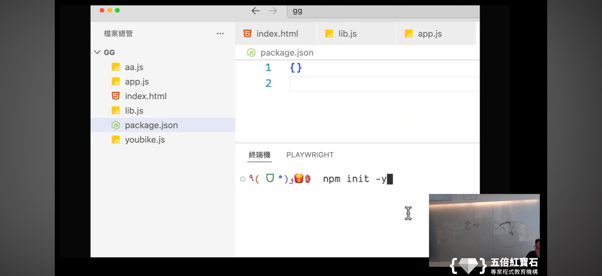

寫腳本測試
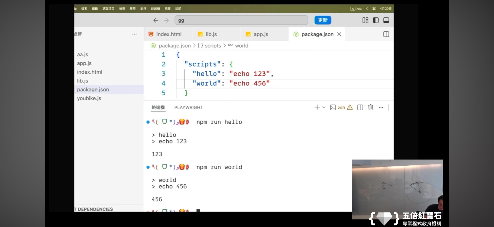

安裝dayjs
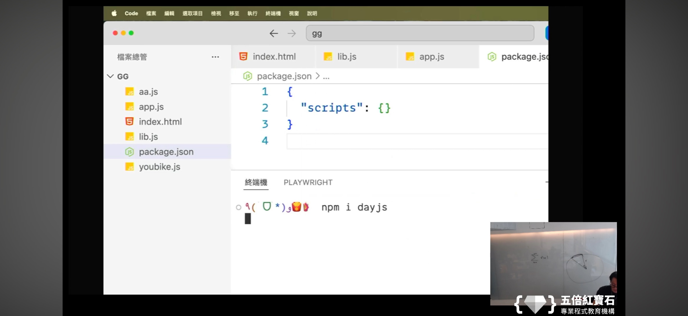

安裝後的變化
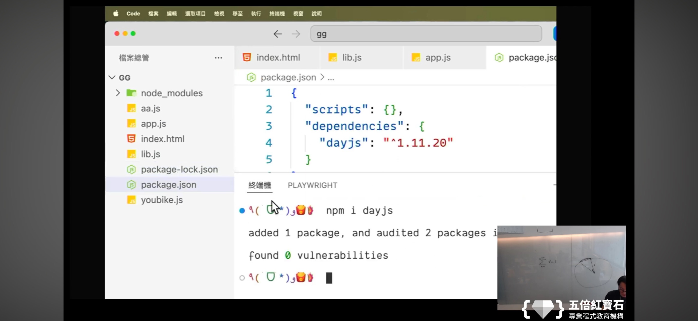

安裝vue
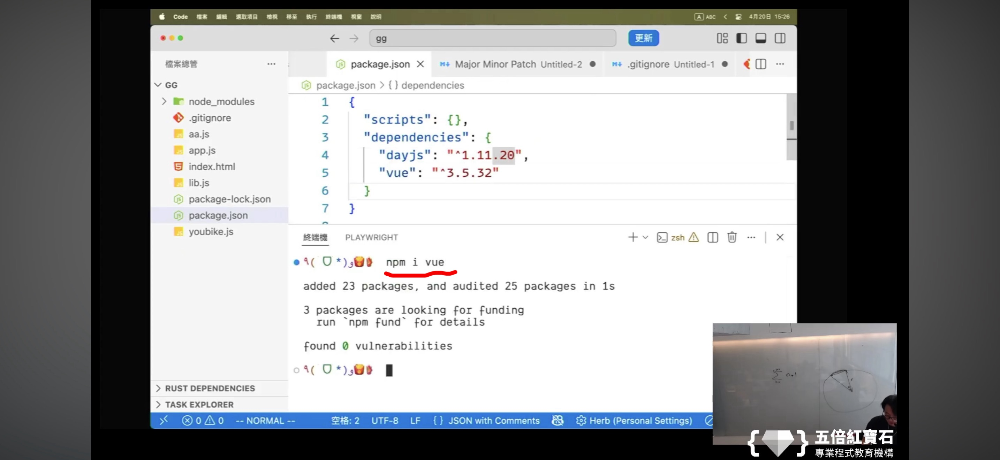

卸載的方式
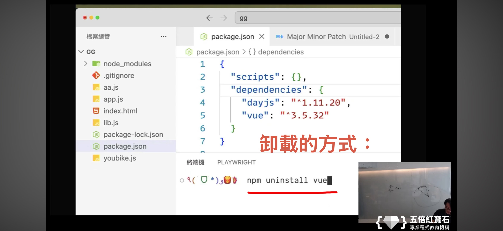

加上"type"="module"
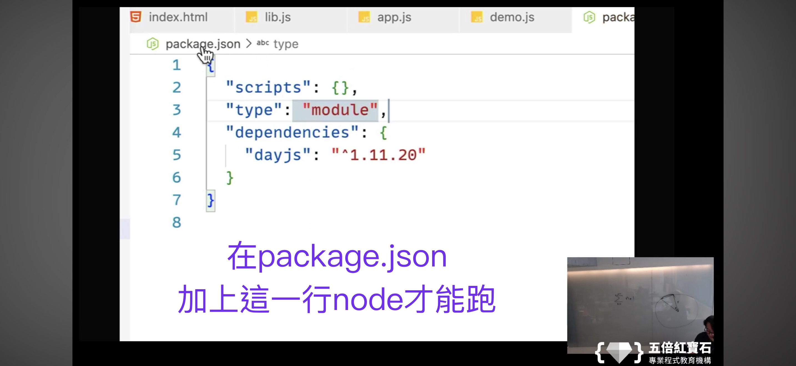

測試node跑成功了沒
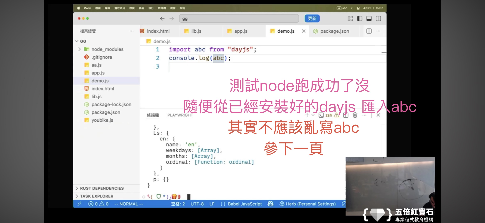

承上頁
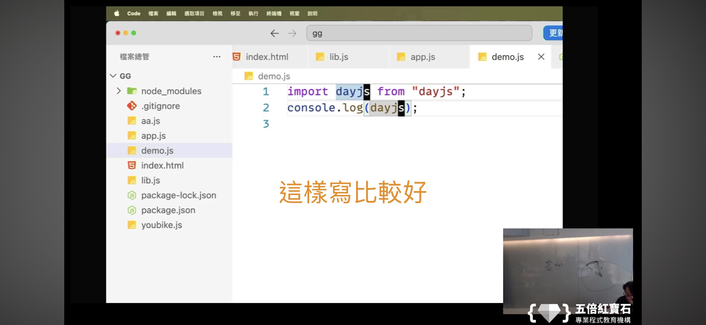

打包工具vite
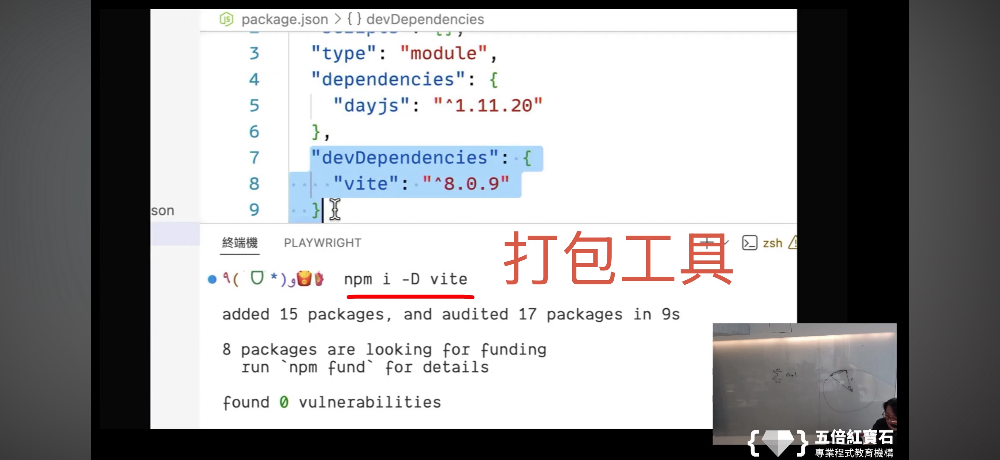

npm run dev
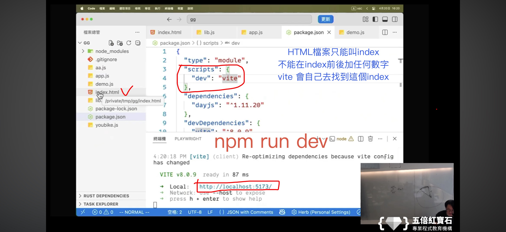

```js
//
結果
————————————————————————————————————————————
```

```js
//
結果
————————————————————————————————————————————
```

```js
//
結果
————————————————————————————————————————————
```

```js
//
結果
————————————————————————————————————————————
```

```js
//
結果
————————————————————————————————————————————
```

```js
//
結果
————————————————————————————————————————————
```

```js
//
結果
————————————————————————————————————————————
```
